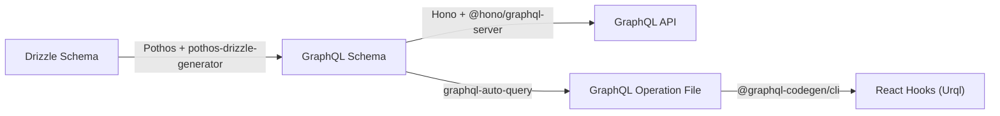
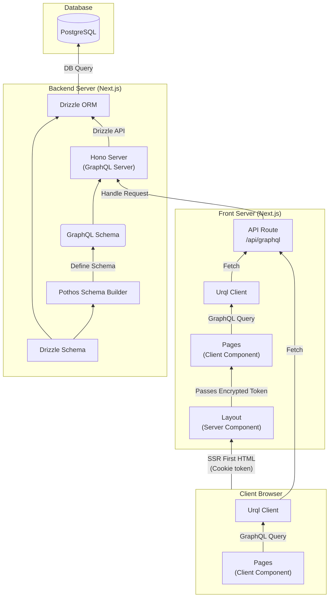
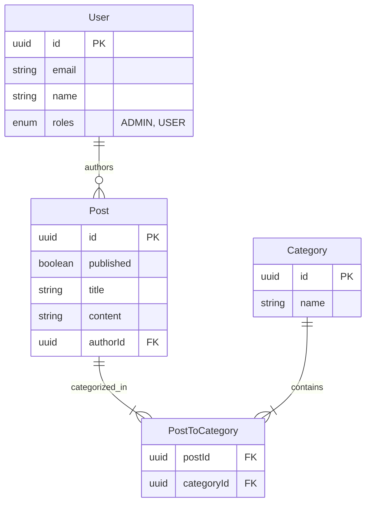
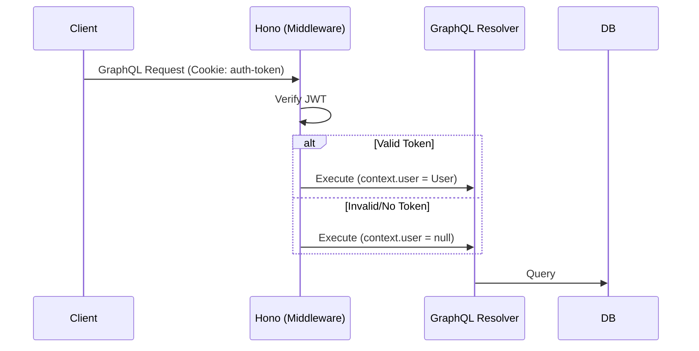
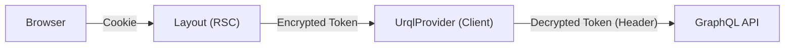

## 概要

Next.js、Drizzle ORM、GraphQL で構築された実装について解説します。

このプロジェクトは、Drizzle ORM で定義したデータベース構造を自動で GraphQL 化し、対応した Hooks の出力まで行います。また、Next.js から SSR 側とブラウザ側のデータ取得コードは共通の Hook で行われるので、別々にデータ取得ロジックを書く必要がありません。

**主な特徴 (Technical Highlights):**

- **Hook の作成まで自動化:** Drizzle で定義した DB のスキーマは、GraphQL スキーマへの変換後、さらに各操作に対応した Hook の作成まで自動で行ないます。
- **N+1 問題の解消:** リレーションを伴うクエリは Drizzle ORM によって最適化され、GraphQL の API に変換されます。
- **データ取得の一元化:** SSR 時のデータ取得を Client Component 上から行う構成により、サーバーとブラウザでデータ取得ロジックを統一できます。



---

## 目次

1.  [プロジェクト概要](#プロジェクト概要)
    - [動作サンプル & リポジトリ](#動作サンプル--リポジトリ)
    - [アプリケーション機能](#アプリケーション機能)
    - [技術スタック](#技術スタック)
    - [アーキテクチャ概要](#アーキテクチャ概要)
2.  [インストールとセットアップ](#インストールとセットアップ)
    - [前提条件](#前提条件)
    - [手順](#手順)
3.  [スクリプト一覧](#スクリプト一覧)
4.  [プロジェクト構成](#プロジェクト構成)
5.  [アーキテクチャと実装詳細](#アーキテクチャと実装詳細)
    - [GraphQL サーバーとスキーマ設計](#graphql-サーバーとスキーマ設計)
    - [認証と認可のフロー](#認証と認可のフロー)
    - [フロントエンド統合（状態管理とフック）](#フロントエンド統合状態管理とフック)
    - [データフェッチと SSR の統合](#データフェッチと-ssr-の統合)
6.  [まとめ](#まとめ)

---

## プロジェクト概要

### 動作サンプル & リポジトリ

- **動作サンプル**: [https://next-drizzle-one.vercel.app/](https://next-drizzle-one.vercel.app/)
- **リポジトリ**: [https://github.com/SoraKumo001/next-drizzle](https://github.com/SoraKumo001/next-drizzle)

### アプリケーション機能

- **投稿管理:**
  - 投稿リストの表示（ホームページ）
  - 投稿詳細の表示（リードオンリービュー）
  - 新規投稿の作成（タイトル、コンテンツ、公開ステータス、カテゴリ）
  - 既存の投稿の編集・削除
  - 下書きシステム（公開/非公開投稿）
- **ユーザーシステム:**
  - ユーザー切り替え/認証（デモ用に簡略化/シミュレート）
  - ユーザーごとの投稿数表示
  - ログイン時の自動リダイレクト
  - ユーザーロール管理
- **カテゴリ管理:**
  - 投稿へのカテゴリ設定
- **管理機能:**
  - データのシード（初期化）リセット機能（ヘッダーボタン）

### 技術スタック

- **フレームワーク:** [Next.js](https://nextjs.org/) (App Router)
- **言語:** TypeScript
- **データベース:** PostgreSQL
- **ORM:** [Drizzle ORM](https://orm.drizzle.team/) 1.00Beta
- **API:** GraphQL (サーバー: Hono + Pothos, クライアント: Urql)
- **スタイリング:** Tailwind CSS + DaisyUI
- **認証:** カスタム JWT 認証
- **コード生成:** GraphQL Codegen

### アーキテクチャ概要

Next.js がフロントとバックエンドサーバーを兼ねていますが、GraphQL を使うことでフロントと DB とやり取りするバックエンド部分は分離されています。また、FirstHTML 出力後は、ServerAction を使用せず、 Urql から GraphQL のキャッシュを利用した Fetch を使用します。



---

## インストールとセットアップ

### 前提条件

- Node.js (v18+)
- pnpm（推奨）, npm, または yarn
- Docker（ローカル開発用データベース）

### 手順

1.  **依存関係のインストール**

    ```bash
    pnpm install
    ```

2.  **データベースの起動**
    Docker Compose を使用して PostgreSQL を起動します。

    ```bash
    pnpm docker
    ```

3.  **データベースのセットアップ**
    スキーマの初期化とシードデータのロード（マイグレーション & シード）を行います。

    ```bash
    pnpm drizzle:reset
    ```

4.  **開発サーバーの起動**

    ```bash
    pnpm dev
    ```

5.  **アプリケーションへのアクセス**
    ブラウザで [http://localhost:3000](http://localhost:3000) を開きます。

---

## スクリプト一覧

開発や運用で使用する主要なコマンドです。

| コマンド                     | 説明                                                        |
| :--------------------------- | :---------------------------------------------------------- |
| `dev`                        | Next.js 開発サーバーを起動します。                          |
| `docker`                     | PostgreSQL コンテナを起動します。                           |
| `build`                      | 本番用にアプリケーションをビルドします。                    |
| `start`                      | 本番サーバーを起動します。                                  |
| `drizzle:generate`           | スキーマ変更に基づいて SQL マイグレーションを生成します。   |
| `drizzle:migrate`            | 開発環境のデータベースにマイグレーションを適用します。      |
| `drizzle:migrate:production` | 本番環境のデータベースにマイグレーションを適用します。      |
| `drizzle:seed`               | テストデータをデータベースにシードします。                  |
| `drizzle:reset`              | データベースをリセットします（マイグレーション + シード）。 |
| `lint`                       | ESLint を実行します。                                       |
| `graphql:schema`             | GraphQL スキーマをエクスポートします。                      |
| `graphql:codegen`            | GraphQL の変更を監視し、TypeScript の型を生成します。       |

---

## プロジェクト構成

このプロジェクトの主要なディレクトリ構成は以下の通りです。

- **`src/`**: アプリケーションのソースコード
  - **`app/`**: Next.js App Router ページと API ルート
  - **`components/`**: 共有 UI コンポーネント（StoreProvider など）
  - **`db/`**: Drizzle スキーマとリレーション定義
  - **`generated/`**: 生成された GraphQL 型とフック
  - **`hooks/`**: カスタム React フック
  - **`libs/`**: ユーティリティライブラリ
  - **`server/`**: GraphQL サーバーロジックとスキーマビルダー
- **`codegen/`**: GraphQL Code Generator 設定
- **`drizzle/`**: データベースマイグレーションファイル
- **`tools/`**: シーディングと管理用スクリプト

---

## アーキテクチャと実装詳細

このプロジェクトでは、**Code-First** アプローチを採用し、開発効率と型安全性を最大化しています。

### GraphQL サーバーとスキーマ設計

#### 1. データモデル (ER 図)



#### 2. スキーマの自動生成 (`src/server/builder.ts`)

[Pothos](https://pothos-graphql.dev/) と Drizzle プラグインを組み合わせることで、DB スキーマから GraphQL スキーマを自動生成します。

自動生成はカスタマイズが可能であり、サンプルの例では以下の機能が提供されます。

- **自動化:** `drizzle-orm` の定義を読み取り、Query/Mutation を即座に作成。
- **セキュリティ (RLS):**
  - `executable`: 認証済みユーザーのみ Mutation を許可。
  - `where`: ユーザー ID に基づき、取得・更新できるデータを自動フィルタリング。
- **カスタマイズ:** 中間テーブルの除外や、システム管理フィールド（`createdAt` など）の入力不可設定。

```ts
import SchemaBuilder from "@pothos/core";
import DrizzlePlugin from "@pothos/plugin-drizzle";
import { getTableConfig } from "drizzle-orm/pg-core";
import PothosDrizzleGeneratorPlugin, {
  isOperation,
} from "pothos-drizzle-generator";
import { relations } from "../db/relations";
import type { Context } from "./context";
import type { Context as HonoContext } from "hono";
import { db } from "../db";

// Tables to exclude from GraphQL schema generation
// Junction tables like "postsToCategories" are typically excluded
const EXCLUDE_TABLES: Array<keyof typeof relations> = ["postsToCategories"];

export interface PothosTypes {
  DrizzleRelations: typeof relations;
  Context: HonoContext<Context>;
}

/**
 * Initialize Pothos Schema Builder with plugins:
 * - DrizzlePlugin: Integrates Drizzle ORM with Pothos
 * - PothosDrizzleGeneratorPlugin: Automatically generates GraphQL schema from Drizzle schema
 */
export const builder = new SchemaBuilder<PothosTypes>({
  plugins: [DrizzlePlugin, PothosDrizzleGeneratorPlugin],
  drizzle: {
    client: () => db,
    relations,
    getTableConfig,
  },
  pothosDrizzleGenerator: {
    // Exclude specific tables from schema generation (e.g., junction tables)
    use: { exclude: EXCLUDE_TABLES },
    // Global configuration applied to all models
    all: {
      // Maximum query depth to prevent deeply nested queries (protection against DoS)
      depthLimit: () => 5,
      // Controls whether operations (findMany, findFirst, count, create, update, delete) are executable
      // This guards against unauthorized mutations by requiring authentication
      executable: ({ operation, ctx }) => {
        if (isOperation(["mutation"], operation) && !ctx.get("user")) {
          return false;
        }
        return true;
      },
      // Configure input fields for create/update operations
      // Excludes auto-managed system fields from user input
      inputFields: () => {
        return { exclude: ["createdAt", "updatedAt"] };
      },
    },
    // Model-specific configuration
    models: {
      posts: {
        // Automatically inject data during create/update operations
        // Sets authorId to the current authenticated user
        inputData: ({ ctx }) => {
          const user = ctx.get("user");
          if (!user) throw new Error("No permission");
          return { authorId: user.id };
        },
        // Apply WHERE clause filters based on operation type
        // This implements row-level security
        where: ({ ctx, operation }) => {
          // For queries (findMany, findFirst, count): show published posts or user's own posts
          if (isOperation(["query"], operation)) {
            return {
              OR: [{ authorId: ctx.get("user")?.id }, { published: true }],
            };
          }
          // For mutations (create, update, delete): only allow operations on user's own posts
          if (isOperation(["mutation"], operation)) {
            return { authorId: ctx.get("user")?.id };
          }
        },
      },
    },
  },
});
```

#### 3. オペレーションの追加 (`src/server/operations.ts`)

自動生成された CRUD 操作以外に、認証（ログイン・ログアウト）やデータシードなどのカスタム操作を追加しています。

```ts
import { builder } from "./builder";
import { setCookie } from "hono/cookie";
import { SignJWT } from "jose";
import { getEnvVariable } from "../libs/getEnvVariable";
import { db } from "../db";
import type { GraphQLSchema } from "graphql";
import { isTable, sql } from "drizzle-orm";
import { getTableConfig, type PgTable } from "drizzle-orm/pg-core";
import { seed } from "drizzle-seed";
import * as dbSchema from "../db/schema";

// Secret key for JWT token signing and verification
const SECRET = getEnvVariable("SECRET");

// JWT token expiration time: 400 days in seconds
const TOKEN_MAX_AGE = 60 * 60 * 24 * 400;

// Cookie configuration shared across authentication operations
const COOKIE_OPTIONS = {
  httpOnly: true,
  sameSite: "strict" as const,
  path: "/",
};

builder.queryType({
  fields: (t) => ({
    // Returns the currently authenticated user
    me: t.drizzleField({
      type: "users",
      nullable: true,
      resolve: (_query, _root, _args, ctx) => {
        const user = ctx.get("user");
        return user || null;
      },
    }),
  }),
});

/**
 * Authentication mutations
 * Provides user authentication functionality including sign-in, sign-out, and current user retrieval
 */
builder.mutationType({
  fields: (t) => ({
    // Authenticates a user by email and sets JWT cookie
    signIn: t.drizzleField({
      args: { email: t.arg({ type: "String" }) },
      type: "users",
      nullable: true,
      resolve: async (_query, _root, { email }, ctx) => {
        const user =
          email &&
          (await db.query.users.findFirst({ where: { email: email } }));
        if (!user) {
          // Authentication failed: clear any existing auth cookie
          setCookie(ctx, "auth-token", "", { ...COOKIE_OPTIONS, maxAge: 0 });
        } else {
          // Authentication successful: generate JWT and set secure cookie
          const token = await new SignJWT({ user: user })
            .setProtectedHeader({ alg: "HS256" })
            .sign(new TextEncoder().encode(SECRET));
          setCookie(ctx, "auth-token", token, {
            ...COOKIE_OPTIONS,
            maxAge: TOKEN_MAX_AGE,
          });
        }
        return user || null;
      },
    }),
    // Signs out the current user by clearing the authentication cookie
    signOut: t.field({
      type: "Boolean",
      nullable: true,
      resolve: async (_root, _args, ctx) => {
        setCookie(ctx, "auth-token", "", { ...COOKIE_OPTIONS, maxAge: 0 });
        return true;
      },
    }),
    // Create seeds
    seeds: t.field({
      type: "Boolean",
      nullable: true,
      resolve: async () => {
        await db.transaction(async (tx) => {
          // drizzle-seedのresetはスキーマ名が巻き込まれるため、相当のものを独自に実装
          await db.execute(
            sql.raw(
              `truncate ${Object.values(dbSchema)
                .filter((t) => isTable(t))
                .map((t) => `"${getTableConfig(t as PgTable).name}"`)
                .join(",")} cascade;`,
            ),
          );
          await seed(tx, dbSchema);
        });
        return true;
      },
    }),
  }),
});

export const schema: GraphQLSchema = builder.toSchema({ sortSchema: false });
```

#### 4. Hono によるサーバー構築 (`src/server/hono.ts`)

GraphQL サーバーの実体には、軽量・高速な [Hono](https://hono.dev/) を使用しています。

- **認証ミドルウェア:** Cookie 内の JWT を検証し、コンテキストに `user` をセットします。
- **Apollo Explorer:** ブラウザアクセス時にクエリをテストできる IDE を提供します。
- **GraphQL エンドポイント:** `@hono/graphql-server` でリクエストを処理します。

```ts
import { graphqlServer } from "@hono/graphql-server";
import { explorer } from "apollo-explorer/html";
import { generate } from "graphql-auto-query";
import { Hono } from "hono";
import { contextStorage } from "hono/context-storage";
import { getContext } from "hono/context-storage";
import { getCookie } from "hono/cookie";
import { jwtVerify } from "jose";
import { schema } from "./builder";
import type { Context } from "./context.js";
import type { relations } from "../db/relations";
import type { Context as HonoContext } from "hono";
import { getEnvVariable } from "@/libs/getEnvVariable";

// Secret key for JWT verification
const SECRET = getEnvVariable("SECRET");

// Cookie name for authentication token
const AUTH_TOKEN_COOKIE = "auth-token";

// Apollo Explorer introspection interval (10 seconds)
const INTROSPECTION_INTERVAL = 10000;

// Sample query generation depth
const QUERY_GENERATION_DEPTH = 1;

/**
 * Middleware to extract and verify JWT token from cookies
 * Sets the authenticated user in the request context
 */
const authMiddleware = async (
  c: HonoContext<Context>,
  next: () => Promise<void>,
) => {
  const cookies = getCookie(c);
  const token = cookies[AUTH_TOKEN_COOKIE] ?? "";

  /**
   * Verify JWT token and extract user information
   * If verification fails (invalid/expired token), user will be undefined
   */
  const user = await jwtVerify(token, new TextEncoder().encode(SECRET))
    .then(
      (data) => data.payload.user as typeof relations.users.table.$inferSelect,
    )
    .catch(() => undefined);
  // Store user in request context
  const context = getContext<Context>();
  context.set("user", user);

  return next();
};

/**
 * Initialize Hono application with custom context type
 * The Context type provides type-safe access to user authentication state
 */
export const app = new Hono<Context>();

/**
 * Enable context storage middleware
 * This allows access to the request context from anywhere in the application
 */
app.use(contextStorage());

/**
 * Apollo Explorer endpoint
 * Provides an interactive GraphQL IDE for testing queries and mutations
 */
app.get("*", (c) => {
  return c.html(
    explorer({
      initialState: {
        // Auto-generate sample GraphQL operations from the schema
        document: generate(schema, QUERY_GENERATION_DEPTH),
      },
      // GraphQL endpoint URL for the explorer to connect to
      endpointUrl: c.req.url,
      // Automatically refresh schema periodically
      introspectionInterval: INTROSPECTION_INTERVAL,
    }),
  );
});

/**
 * GraphQL endpoint
 * Handles GraphQL queries and mutations via POST requests
 * Authentication is handled by the authMiddleware
 */
app.post("*", authMiddleware, (c, next) => {
  return graphqlServer({
    schema,
  })(c, next);
});
```

#### 5. Next.js Route Handler への統合 (`src/app/api/graphql/route.ts`)

Web Standard API に準拠した Hono サーバーを、Next.js Route Handler としてマウントします。

```ts
"use server";
import { app } from "../../../server/hono";

export async function POST(request: Request) {
  return app.fetch(request);
}

export async function GET(request: Request) {
  return app.fetch(request);
}
```

#### 6. クライアント用クエリの自動生成 (`graphql-auto-query`)

このプロジェクトでは、`graphql-auto-query` を使用して、GraphQL スキーマからクライアントサイドで使用するクエリ（オペレーション）を自動生成しています。これにより、手動でのクエリ記述の手間を省き、開発効率を向上させています。

- **CLI での生成:**
  `npm run graphql:schema` コマンド実行時に、エクスポートされたスキーマ (`codegen/schema.graphql`) を元に、利用可能なすべての Query と Mutation を網羅した `.graphql` ファイル (`graphql/query.graphql`) を生成します。

  ```json
  "scripts": {
    "graphql:schema": "tsx ./tools/export-schema.ts && graphql-auto-query ./codegen/schema.graphql -o ./graphql/query.graphql"
  }
  ```

- **Apollo Explorer での活用:**
  `src/server/hono.ts` 内でも `graphql-auto-query` の `generate` 関数を使用し、Apollo Explorer の初期状態としてサンプルクエリを自動セットしています。これにより、開発者はブラウザですぐに動作確認を行えます。

### 認証と認可のフロー

セキュリティと UX を両立させるため、堅牢な認証フローと、透過的な SSR 対応を実装しています。

#### A. 認証 (Authentication)

サーバーサイドでの身元確認プロセスです。

1.  **JWT 生成:** `signIn` Mutation でユーザー検証後、署名付き JWT を生成。
2.  **Cookie 保存:** `HttpOnly`, `SameSite: Strict` 属性を持つ Cookie に保存（XSS 対策）。
3.  **リクエスト検証:** Hono ミドルウェアがリクエスト毎に検証し、コンテキストに `user` を注入。



#### B. 認可 (Authorization)

「誰が何をできるか」を GraphQL スキーマレベルで制御します。

- **Mutation 保護:** 未認証ユーザーによる書き込み操作（作成・更新・削除）をブロック。
- **行レベルセキュリティ (RLS):**
  - **Read:** 公開記事、または自分の下書き記事のみ取得可能。
  - **Write:** 自分が作成した記事のみ編集・削除可能。

#### C. SSR における認証トークンの受け渡し

Next.js (Server Component) から GraphQL API への内部通信ではブラウザの Cookie が自動付与されないため、以下の仕組みで状態を引き継ぎます。

1.  **Layout (RSC):** Cookie を読み取り、暗号化。
2.  **UrqlProvider (Client):** 暗号化されたトークンを Props として受け取る。
3.  **GraphQL Request:** トークンを復号し、SSR 中のリクエストヘッダーにセット。



### フロントエンド統合（状態管理とフック）

サーバーサイドの認証状態（Cookie）と同期しつつ、クライアントサイドでリアクティブな UI を実現します。

#### A. 軽量なグローバル状態管理 (`src/components/StoreProvider.tsx`)

React 18 の `useSyncExternalStore` を活用し、外部ライブラリ（Redux 等）なしで「現在のログインユーザー」をアプリ全体で共有します。SSR データとの整合性も保たれます。

#### B. 認証用カスタムフック (`src/hooks/useAuth.ts`)

| フック名       | 役割                                                              |
| :------------- | :---------------------------------------------------------------- |
| `useUser()`    | 現在ログインしているユーザー情報を取得。                          |
| `useSignIn()`  | ログインを実行し、ローカルストアを更新して UI に即座に反映。      |
| `useSignOut()` | ログアウトを実行し、Cookie 削除とともにローカルストアをリセット。 |

#### 認証の実装例

```tsx
"use client";
import { useFindManyUserQuery } from "@/generated/graphql";
import { useSignIn } from "@/hooks/useAuth";
import Link from "next/link";
import { useRouter } from "next/navigation";

const context = { additionalTypenames: ["User"] };

export default function Users() {
  const [{ data, fetching, error }, executeQuery] = useFindManyUserQuery({
    context,
  });
  const signIn = useSignIn();
  const router = useRouter();

  return (
    <>
      <title>Users</title>
      <div className="container mx-auto p-4 max-w-5xl">
        <Link href="/" className="btn btn-link no-underline pl-0 mb-4">
          &larr; Back to Home
        </Link>

        <div className="flex items-center gap-3 mb-8">
          <h1 className="text-3xl font-bold">Users</h1>
          <button
            className={`btn btn-circle btn-ghost btn-sm ${
              fetching ? "animate-spin" : ""
            }`}
            onClick={() => executeQuery({ requestPolicy: "network-only" })}
            title="Refresh"
            disabled={fetching}
          >
            {fetching ? (
              <span className="loading loading-spinner loading-xs"></span>
            ) : (
              <span className="material-symbols-outlined">refresh</span>
            )}
          </button>
        </div>

        {error ? (
          <div className="alert alert-error my-4">
            <span className="material-symbols-outlined">error</span>
            <span>Error: {error.message}</span>
          </div>
        ) : fetching && !data ? (
          <div className="flex justify-center items-center py-20">
            <span className="loading loading-spinner loading-lg"></span>
          </div>
        ) : (
          <div className="grid grid-cols-1 md:grid-cols-2 lg:grid-cols-3 gap-6">
            {data?.findManyUser?.map((user) => (
              <div
                key={user.id}
                className="card bg-base-100 shadow-sm border border-base-200 hover:shadow-md hover:border-base-300 transition-all"
              >
                <div className="card-body flex flex-row items-center gap-4">
                  <div className="avatar placeholder">
                    <div className="bg-neutral text-neutral-content rounded-full w-12 h-12 flex items-center justify-center">
                      <span className="text-xl font-bold">
                        {user.name.charAt(0).toUpperCase()}
                      </span>
                    </div>
                  </div>
                  <div className="flex-1 min-w-0">
                    <div className="flex items-center gap-2">
                      <h2
                        className="card-title text-lg truncate"
                        title={user.name}
                      >
                        {user.name}
                      </h2>
                      {user.postsCount !== undefined && (
                        <div className="badge badge-secondary badge-sm">
                          {user.postsCount} posts
                        </div>
                      )}
                    </div>
                    <p className="text-sm text-base-content/70 truncate">
                      {user.email}
                    </p>
                  </div>
                </div>
                <div className="card-actions justify-end p-4 pt-0">
                  <button
                    onClick={async () => {
                      await signIn(user.email);
                      router.push("/");
                    }}
                    className="btn btn-primary btn-sm"
                  >
                    Sign In
                  </button>
                </div>
              </div>
            ))}
          </div>
        )}

        {!fetching && !error && data?.findManyUser?.length === 0 && (
          <div className="text-center py-10 text-base-content/50">
            <p>No users found.</p>
          </div>
        )}
      </div>
    </>
  );
}
```

### データフェッチと SSR の統合

Next.js App Router 上で、Client Component からのデータ取得を SSR 対応させています。

#### `@react-libraries/next-exchange-ssr` の活用

1.  **データプリフェッチ:** SSR 中に実行されたクエリ結果を収集。
2.  **ハイドレーション:** 収集したデータを HTML に埋め込み、クライアントでの再取得を回避。
3.  **RSC 不要:** `use client` コンポーネントでも SEO や初期表示パフォーマンスを維持。

Urql を利用するときは、ユーザーの切り替えなどでキャッシュをクリアできるようにしています。

```tsx
"use client";
import {
  NextSSRProvider,
  useCreateNextSSRExchange,
} from "@react-libraries/next-exchange-ssr";
import { type RetryExchangeOptions, retryExchange } from "@urql/exchange-retry";
import { type ReactNode, useCallback, useMemo } from "react";
import { cacheExchange, Client, fetchExchange, Provider } from "urql";
import { useUser } from "../hooks/useAuth";
import { decrypt } from "../libs/encrypt";
import { useDispatch, useSelector } from "./StoreProvider";

const isServerSide = typeof window === "undefined";
const endpoint = "/api/graphql";

const options: RetryExchangeOptions = {
  maxDelayMs: 3000,
  randomDelay: false,
};

export const UrqlProvider = ({
  children,
  host,
  token,
}: {
  children: ReactNode;
  host?: string;
  token?: string;
}) => {
  const session = useUser();
  const nextSSRExchange = useCreateNextSSRExchange();
  const cacheState = useUrqlCache();
  const client = useMemo(() => {
    return new Client({
      url: `${host}${endpoint}`,
      fetchOptions: {
        headers: {
          "apollo-require-preflight": "true",
          cookie:
            // SSR時にtokenをデコードして認証情報を渡す
            isServerSide && token
              ? `auth-token=${decrypt(token, process.env.secret ?? "")}`
              : "",
        },
      },
      suspense: isServerSide,
      exchanges: [
        cacheExchange,
        nextSSRExchange,
        retryExchange(options),
        fetchExchange,
      ],
      preferGetMethod: false,
    });
    // eslint-disable-next-line react-hooks/exhaustive-deps
  }, [nextSSRExchange, session, cacheState]);
  return (
    <Provider value={client}>
      <NextSSRProvider>{children}</NextSSRProvider>
    </Provider>
  );
};

export const useUrqlCache = () => {
  return useSelector((state: { urqlCache: object }) => state.urqlCache);
};

export const useClearUrqlCache = () => {
  const dispatch = useDispatch<{ urqlCache: object }>();

  return useCallback(() => {
    dispatch((state) => ({
      ...state,
      urqlCache: {},
    }));
  }, [dispatch]);
};
```

#### 認証 Token と GraphQL エンドポイントの設定

`layout.tsx`は唯一の ServerComponent です。ここでアクセス時に発生したヘッダー情報を利用して Token の受け渡しや SSR 時に利用する GraphQL のエンドポイントの指定を行います。

- **Token の受け渡し:** クライアントコンポーネントに暗号化された認証トークンを渡します。これは SSR 時にサーバー上で認証状態を保持するためだけに利用されます。ブラウザに引き渡された後は、直接ブラウザ内の Cookie を利用するため不要となります。
- **GraphQL エンドポイントの指定:** SSR 時に利用する GraphQL のエンドポイントを `UrqlProvider` に渡します。

```tsx
import { Geist, Geist_Mono } from "next/font/google";
import { UrqlProvider } from "../providers/UrqlProvider";
import { StoreProvider } from "../providers/StoreProvider";
import { cookies, headers } from "next/headers";
import { jwtVerify } from "jose";
import type { users } from "../db/schema";
import { encrypt } from "../libs/encrypt";
import { Header } from "../components/Header";
import "./globals.css";

const geistSans = Geist({
  variable: "--font-geist-sans",
  subsets: ["latin"],
});

const geistMono = Geist_Mono({
  variable: "--font-geist-mono",
  subsets: ["latin"],
});

async function getOrigin() {
  const headersList = await headers();
  const host = headersList.get("x-forwarded-host") || headersList.get("host");
  const protocol = headersList.get("x-forwarded-proto") || "http";
  return `${protocol}://${host}`;
}

export default async function RootLayout({
  children,
}: Readonly<{
  children: React.ReactNode;
}>) {
  // Get token from cookies
  const token = await cookies().then((v) => v.get("auth-token")?.value);
  // Get origin for GraphQL client
  const host = await getOrigin();
  // Verify user token
  const user =
    token &&
    (await jwtVerify<{ payload: { user?: typeof users.$inferSelect } }>(
      String(token),
      new TextEncoder().encode(process.env.secret),
    )
      .then(({ payload: { user } }) => user as typeof users.$inferSelect)
      .then(({ id, name }: typeof users.$inferSelect) => ({ id, name }))
      .catch(() => undefined));

  return (
    <StoreProvider
      initState={{
        user,
      }}
    >
      <UrqlProvider
        host={host}
        // Pass encrypted token to Client Component
        token={token && encrypt(token, process.env.secret ?? "")}
      >
        <html lang="en">
          <body
            className={`${geistSans.variable} ${geistMono.variable} antialiased`}
          >
            <div className="max-w-257 mx-auto">
              <Header />
              {children}
            </div>
          </body>
        </html>
      </UrqlProvider>
    </StoreProvider>
  );
}
```

#### 実装例: 投稿一覧ページ

SSR 時も Client Component 上でデータ取得が行われ HTML が返されます。ServerComponent でデータを取得した場合と違い、そのままブラウザで動作するので、サーバーとブラウザで別コードを書く必要がありません。

```tsx
"use client";
import { useFindManyPostQuery, OrderBy } from "@/generated/graphql";
import Link from "next/link";
import { PostCard } from "@/components/PostCard";

const context = { additionalTypenames: ["Post"] };

export default function Home() {
  const [{ data, error, fetching }, executeQuery] = useFindManyPostQuery({
    variables: { orderBy: [{ createdAt: OrderBy.Desc }] },
    context,
  });

  return (
    <>
      <title>Home</title>
      <div className="p-4">
        <div className="flex justify-between items-center mb-8">
          <div className="flex items-center gap-3">
            <h1 className="text-3xl font-bold">Latest Posts</h1>
            <button
              className={`btn btn-circle btn-ghost btn-sm ${
                fetching ? "animate-spin" : ""
              }`}
              onClick={() => executeQuery({ requestPolicy: "network-only" })}
              title="Refresh"
              disabled={fetching}
            >
              {fetching ? (
                <span className="loading loading-spinner loading-xs"></span>
              ) : (
                <span className="material-symbols-outlined">refresh</span>
              )}
            </button>
          </div>
          <Link href="/posts/new" className="btn btn-primary">
            Create New Post
          </Link>
        </div>

        {error ? (
          <div className="alert alert-error my-4">
            <span className="material-symbols-outlined">error</span>
            <span>Error: {error.message}</span>
          </div>
        ) : fetching ? (
          <div className="flex justify-center items-center py-20">
            <span className="loading loading-spinner loading-lg"></span>
          </div>
        ) : (
          <div className="grid grid-cols-1 md:grid-cols-2 lg:grid-cols-3 gap-6">
            {data?.findManyPost?.map((post) => (
              <PostCard key={post.id} post={post} />
            ))}
          </div>
        )}

        {!fetching && !error && data?.findManyPost?.length === 0 && (
          <div className="text-center py-10 text-base-content/50">
            <p>No posts found. Be the first to create one!</p>
          </div>
        )}
      </div>
    </>
  );
}
```

## まとめ

Drizzle と GraphQL を統合することで、DB スキーマの定義から React Hooks の生成までをシームレスに自動化しました。これにより、開発者は API のボイラープレート作成から解放され、UI 実装に専念できます。また、Client Component を起点としたデータ取得戦略により、サーバー（SSR）とブラウザ（CSR）の環境差分を意識せず、単一のロジックで一貫したフェッチ処理を実現しています。このアプローチは、開発効率を大幅に向上させ、保守性の高いアプリケーション開発を強力に支援します。このプロジェクトが、同様の技術スタックを採用する際の参考になれば幸いです。
