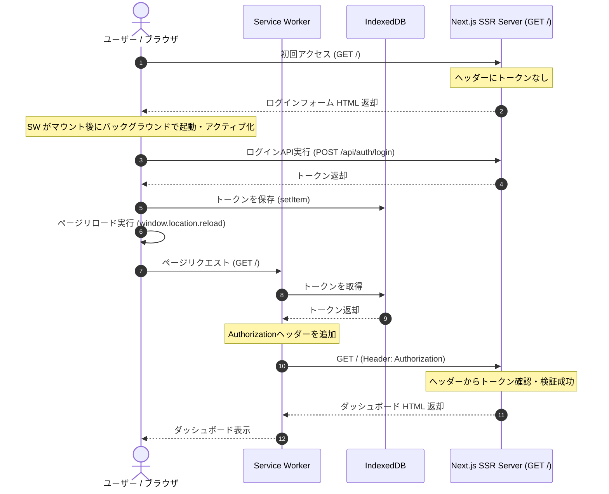

- サンプルコード
  https://github.com/SoraKumo001/next-worker-auth

- Demo
  https://next-worker-auth.vercel.app/

Webの認証といえばCookie（HttpOnly）を使っておけばまず安全、というのが定番です。ただ、これがスマホアプリのWebViewだったり、クロスドメインでAPIサーバーと通信したりする状況になると、急にCookieの管理が面倒になります。SameSite属性の考慮が必要だったり、ブラウザのサードパーティCookie規制でトークンが消えたりしてハマった経験がある方も多いのではないでしょうか。

そこでCookieを使わずに `localStorage` や `IndexedDB` にトークンを置くアプローチを取るのですが、そうすると今度はSSR（Server-Side Rendering）の段階でトークンをサーバーへ送れなくなります。最初のドキュメントリクエストの時点ではJavaScriptが動かないので、リクエストヘッダーにトークンを載せられず、結果として初期描画をサーバー側で制御できなくなってしまいます。

この問題をなんとか解決できないかと考えて実装したのが、**Service Worker** と **IndexedDB** を組み合わせて、ドキュメントリクエストそのものを横取りしてヘッダーを注入するアプローチです。Next.js (App Router) を使い、Cookieレスでありながら同一URLでSSR時の認証分岐を実現するデモを作ってみました。

※ 普通にCookieを使える環境なら、ぶっちゃけこのやり方は実装を複雑化させるだけなので、メリットがありません

---

## 仕組みと動作フロー

この仕組みの要は、ブラウザとサーバーの間にService Worker（SW）を挟み込む点にあります。SWが制御しているページから発生する同一オリジンのリクエスト（画面遷移時のドキュメント取得も含む）をプロキシし、IndexedDBから引っ張ってきたトークンを `Authorization: Bearer <token>` ヘッダーとして動的に差し込みます。

ただし、SWは初回アクセスのドキュメントリクエストをさかのぼって制御できるわけではありません。このアプローチは、SWがインストールされてページを制御できる状態になった後のリロードや画面遷移で効いてくる仕組みです。

全体の動きは以下の通りです。



ログインからSSRの切り替えまで、URLは一切変わらず `/` のままです。Cookieは1バイトも使っていません。

---

## 主要コードの実装

デモアプリを構成するコアコードを見ていきます。

### 1. IndexedDB ユーティリティ (`src/utils/db.ts`)

まずはメインスレッドとService Workerの双方からアクセスできる共通ストレージとして、IndexedDBを使います。メインスレッド側では簡単なラッパーを用意しました。SW側からも同じDB名・Store名でアクセスできるようにしておきます。

```typescript:src/utils/db.ts
const DB_NAME = 'next-sw-auth-db';
const STORE_NAME = 'auth-store';
const DB_VERSION = 1;

function getDB(): Promise<IDBDatabase> {
  return new Promise((resolve, reject) => {
    if (typeof indexedDB === 'undefined') {
      reject(new Error('IndexedDB is not supported in this environment.'));
      return;
    }
    const request = indexedDB.open(DB_NAME, DB_VERSION);
    request.onerror = () => reject(request.error);
    request.onsuccess = () => resolve(request.result);
    request.onupgradeneeded = () => {
      const db = request.result;
      if (!db.objectStoreNames.contains(STORE_NAME)) {
        db.createObjectStore(STORE_NAME);
      }
    };
  });
}

export async function setItem(key: string, value: any): Promise<void> {
  const db = await getDB();
  return new Promise((resolve, reject) => {
    const transaction = db.transaction(STORE_NAME, 'readwrite');
    const store = transaction.objectStore(STORE_NAME);
    const request = store.put(value, key);
    request.onsuccess = () => resolve();
    request.onerror = () => reject(request.error);
  });
}

export async function getItem<T>(key: string): Promise<T | null> {
  try {
    const db = await getDB();
    return new Promise((resolve, reject) => {
      const transaction = db.transaction(STORE_NAME, 'readonly');
      const store = transaction.objectStore(STORE_NAME);
      const request = store.get(key);
      request.onsuccess = () => resolve(request.result || null);
      request.onerror = () => reject(request.error);
    });
  } catch (error) {
    return null;
  }
}

export async function removeItem(key: string): Promise<void> {
  const db = await getDB();
  return new Promise((resolve, reject) => {
    const transaction = db.transaction(STORE_NAME, 'readwrite');
    const store = transaction.objectStore(STORE_NAME);
    const request = store.delete(key);
    request.onsuccess = () => resolve();
    request.onerror = () => reject(request.error);
  });
}
```

### 2. Service Worker でのリクエスト傍受とヘッダー注入 (`public/sw.js`)

ここが一番のポイントです。SWの `fetch` イベントで通信をフックし、必要なリクエストに対してだけIndexedDBのトークンを乗せます。

```javascript:public/sw.js
const DB_NAME = 'next-sw-auth-db';
const STORE_NAME = 'auth-store';
const DB_VERSION = 1;

// インストール後、待機せずに即座にアクティブ化
self.addEventListener('install', () => {
  self.skipWaiting();
});

// アクティブ化されたら、制御下にある全クライアントを即座に引き受ける
self.addEventListener('activate', (event) => {
  event.waitUntil(self.clients.claim());
});

// IndexedDB からアクセストークンを取得するヘルパー
function getTokenFromIndexedDB() {
  return new Promise((resolve) => {
    const request = indexedDB.open(DB_NAME, DB_VERSION);
    request.onerror = () => resolve(null);
    request.onsuccess = () => {
      const db = request.result;
      if (!db.objectStoreNames.contains(STORE_NAME)) {
        resolve(null);
        return;
      }
      try {
        const transaction = db.transaction(STORE_NAME, 'readonly');
        const store = transaction.objectStore(STORE_NAME);
        const getRequest = store.get('accessToken');
        getRequest.onsuccess = () => resolve(getRequest.result || null);
        getRequest.onerror = () => resolve(null);
      } catch (e) {
        resolve(null);
      }
    };
    request.onupgradeneeded = () => {
      const db = request.result;
      if (!db.objectStoreNames.contains(STORE_NAME)) {
        db.createObjectStore(STORE_NAME);
      }
    };
  });
}

// リクエストの傍受
self.addEventListener('fetch', (event) => {
  const url = new URL(event.request.url);

  // 同一オリジンのリクエストのみを対象にする
  if (url.origin !== self.location.origin) {
    return;
  }

  // 静的アセット、特定ビルドファイル、webpackのHMR用ソケット通信はスキップ
  if (
    url.pathname.startsWith('/_next/static/') ||
    url.pathname.includes('.') ||
    url.pathname.includes('/webpack-hmr')
  ) {
    return;
  }

  // ドキュメント遷移、APIリクエスト、RSC通信などを対象にインターセプト
  // このデモでは「同一オリジンかつ静的アセットではないもの」を対象にする
  event.respondWith(
    (async () => {
      const token = await getTokenFromIndexedDB();

      // ヘッダーをクローンし、トークンが存在すれば Authorization を設定
      const headers = new Headers(event.request.headers);
      if (token) {
        headers.set('Authorization', `Bearer ${token}`);
      }

      // 変更後のリクエストオプションを構築
      const requestInit = {
        method: event.request.method,
        headers: headers,
        credentials: event.request.credentials,
        // ナビゲーションリクエスト（HTMLドキュメント取得）の mode は 'navigate' だが、
        // fetchで中継する際はセキュリティの都合上 'same-origin' 等に書き換える
        mode: event.request.mode === 'navigate' ? 'same-origin' : event.request.mode,
      };

      // GETやHEAD以外のリクエスト（POSTやPUTなど）の場合、ボディをクローンして引き継ぐ
      if (event.request.method !== 'GET' && event.request.method !== 'HEAD') {
        try {
          requestInit.body = await event.request.clone().blob();
        } catch (e) {
          console.error('[SW] Failed to clone request body:', e);
        }
      }

      try {
        // Authorization ヘッダーを付与したリクエストをサーバーに送信
        const response = await fetch(event.request.url, requestInit);
        return response;
      } catch (error) {
        console.error('[SW] Fetch proxy failed, falling back to original request:', error);
        return fetch(event.request);
      }
    })()
  );
});
```

静的アセット（`/_next/static/` や `.css`、`.png` など）やNext.jsの開発用ホットリロードソケットまで処理するとパフォーマンスが落ちるため、これらは最初に除外しておきます。今回のデモでは単純に「パスに `.` を含むもの」を除外していますが、実運用ではAPIやファイル配信のURL設計に合わせて条件を調整してください。

また、`skipWaiting()` と `self.clients.claim()` を使って、SWがインストールされた後にページを制御しやすくしています。ただし、これでも初回のトップレベルナビゲーションそのものは制御できないため、初回だけ未認証表示になる可能性は残ります。

なお、このサンプルでは `RequestInit` を組み立て直していますが、実運用では `cache`、`redirect`、`referrer`、`integrity` などのリクエスト情報を落とさないように注意が必要です。対象をドキュメントリクエストに絞る、または `new Request(event.request, { headers })` のように元のRequestをベースに複製するほうが安全なケースもあります。

### 3. Service Worker の登録と監視 (`src/components/ServiceWorkerRegister.tsx`)

クライアントサイドでSWをアクティブ化しつつ、登録状況を画面右上に見やすく表示するデバッグ用のコンポーネントです。

```tsx:src/components/ServiceWorkerRegister.tsx
'use client';

import React, { useEffect, useState } from 'react';

export default function ServiceWorkerRegister({ children }: { children: React.ReactNode }) {
  const [swStatus, setSwStatus] = useState<'initializing' | 'active' | 'unsupported' | 'error'>(() => {
    if (typeof window === 'undefined') return 'initializing';
    if (!('serviceWorker' in navigator)) return 'unsupported';
    if (navigator.serviceWorker.controller) return 'active';
    return 'initializing';
  });

  useEffect(() => {
    if (swStatus === 'unsupported' || swStatus === 'active') {
      return;
    }

    const registerSW = async () => {
      try {
        const registration = await navigator.serviceWorker.register('/sw.js');
        console.log('[Register] SW registered:', registration);

        if (navigator.serviceWorker.controller) {
          setSwStatus('active');
          return;
        }

        // Service Worker が実際にページをコントロールし始める瞬間を監視
        const onControllerChange = () => {
          console.log('[Register] Controller changed, SW now in control');
          setSwStatus('active');
          navigator.serviceWorker.removeEventListener('controllerchange', onControllerChange);
        };

        navigator.serviceWorker.addEventListener('controllerchange', onControllerChange);
      } catch (error) {
        console.error('[Register] SW registration failed:', error);
        setSwStatus('error');
      }
    };

    registerSW();
  }, [swStatus]);

  return (
    <>
      <div
        style={{
          position: 'fixed',
          top: '1rem',
          right: '1rem',
          zIndex: 9999,
          padding: '0.4rem 0.85rem',
          borderRadius: '9999px',
          fontSize: '0.75rem',
          fontWeight: 700,
          fontFamily: 'monospace',
          background: swStatus === 'active' ? 'rgba(16, 185, 129, 0.15)' : 'rgba(245, 158, 11, 0.15)',
          border: `1px solid ${swStatus === 'active' ? '#10b981' : '#f59e0b'}`,
          color: swStatus === 'active' ? '#10b981' : '#f59e0b',
          backdropFilter: 'blur(8px)',
          pointerEvents: 'none',
          boxShadow: '0 4px 12px rgba(0,0,0,0.1)',
        }}
      >
        🛡️ SW: {swStatus.toUpperCase()}
      </div>
      {children}
    </>
  );
}
```

RSCでそのままHTMLを描画しつつ、マウント後にバックグラウンドで登録が走ります。`controllerchange` イベントを監視して、SWが本当に制御を開始したタイミングでバッジを `ACTIVE` に切り替えています。

### 4. Next.js サーバーサイドでの認証検証 (`src/app/page.tsx`)

サーバー側（React Server Components）では、受け取ったリクエストの `headers` から `authorization` を取得するだけで認証状態の判定が可能です。Cookieの読み取りは一切不要です。

```tsx:src/app/page.tsx
import { headers, cookies } from 'next/headers';
import LoginForm from '@/components/LoginForm';
import DashboardView from '@/components/DashboardView';

// サーバーサイドでのモックユーザー検証
async function verifyUser(token: string) {
  if (token === 'mock-session-token-xyz789') {
    return {
      name: 'Demo Admin',
      role: 'Administrator',
      email: 'admin@demo-sandbox.io',
      bio: 'このコンテンツは、同一のルートURL (/) でサーバーサイドレンダリング (SSR) されました。ページリロード時に、Service Worker が IndexedDB からトークンを取得し、Authorization ヘッダーを動的に注入しています。',
    };
  }
  return null;
}

export default async function RootPage() {
  const headersList = await headers();
  const cookiesList = await cookies();

  const authHeader = headersList.get('authorization');
  let user = null;
  let token = null;

  if (authHeader && authHeader.startsWith('Bearer ')) {
    token = authHeader.substring(7);
    user = await verifyUser(token);
  }

  // デモ上、Cookie が空であることを画面に表示するために取得
  const allCookies = cookiesList.getAll();
  const cookieDisplay = allCookies.length > 0
    ? allCookies.map(c => `${c.name}=${c.value}`).join('; ')
    : '(empty)';

  if (user && token) {
    return (
      <DashboardView
        token={token}
        user={user}
        cookieDisplay={cookieDisplay}
      />
    );
  }

  return <LoginForm />;
}
```

ここではダミーの検証ロジックを呼んでいますが、実際のアプリなら外部のAPIサーバーや認証プロバイダと連携させる部分ですね。`cookies()` はデモ表示のために呼んでいるだけで、認証判定自体はCookieに依存していません。Cookieが空でも、サーバーはヘッダー経由でトークンを確認できています。

---

## ページリロードとログイン・ログアウトの制御

この設計で重要になるのが、ログイン・ログアウトの瞬間の制御です。

ログインが成功した後は、単にSPA的な遷移をするのではなく、`window.location.reload()` でページそのものをリロードさせます。

```typescript:LoginForm.tsx(抜粋)
await setItem('accessToken', data.token);
window.location.reload();
```

これによりブラウザが再度 `/` にアクセスし、アクティブになったSWがリクエストを横取りしてトークン付きでサーバーへ転送します。結果、サーバーは即座に認証後のUI（Dashboard）を描画できます。

ログアウト時は、IndexedDBからトークンを消した後に `window.location.href = '/'` でリダイレクトします。

```typescript:LogoutButton.tsx(抜粋)
await removeItem('accessToken');
window.location.href = '/';
```

SWがヘッダーを載せずにサーバーへ要求を投げ直すため、サーバー側で自動的にログインフォームへ表示が切り替わる仕組みです。

---

## Cookieフリー認証のメリットと考慮すべき点

実際に作ってみて感じたメリットと、考慮すべき課題です。

### メリット

- **CookieベースのCSRFリスクを受けにくい**: Cookieの自動送信に依存しないため、典型的なCSRFの影響を受けにくくなります。
- **ドメインの壁がない**: WebアプリとAPIサーバーのドメインが分かれていても、クロスドメインCookieの設定に悩まされずに済みます。
- **サードパーティCookie制限の影響を受けにくい**: WebViewやプライバシー重視のブラウザなど、Cookie規制が厳しいクライアント環境下でも設計しやすくなります。

### 気をつけるべき課題

- **初回アクセスの壁**: ユーザーが初めてページを開いた瞬間は、まだSWがインストール＆起動していません。そのため、初回のドキュメントリクエストにはトークンが載らず、サーバーは未認証として振る舞うことになります。初回だけはクライアント側でIndexedDBを見てローディングを挟むなど、何らかのフォールバックが必要です。
- **XSSとの戦い**: `HttpOnly` なCookieと違って、IndexedDBはJSから読めてしまいます。XSS脆弱性があるとトークンが抜かれるリスクがあるため、アクセストークンの寿命を数分程度に短くする、Refresh Tokenをより保護された経路で扱う、ネイティブアプリ側の安全なストレージと組み合わせるなど、トークン運用をきっちり設計しておくことが大前提になります。
- **開発時のキャッシュの考慮**: Next.jsのHMRなどと競合しないよう、SWのバイパス設定を細かく書いておく必要があります。今回のコードでもwebpack関連のパスを避けていますが、プロダクションに載せる際はアセットの判定に少し気を使います。

---

## 終わりに

出来そうだからやってみただけなので、本気でやろうとは思わないほうが無難です
