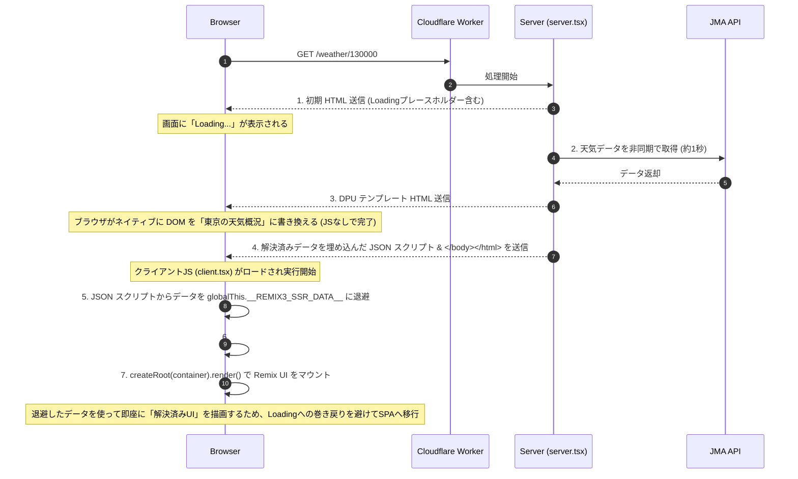

近年、Web標準として提案され Chrome 等で試験実装が進んでいる **Declarative Partial Updates (DPU)** は、HTML の out-of-order ストリーミング（順不同な部分更新）を **JavaScript なし** で実現する画期的な技術です。

本記事では、この DPU と Remix 3 (`@remix-run/ui`) を組み合わせ、JS 無効環境でも非同期データの遅延読み込みと部分更新が行え、JS 有効環境ではスムーズに SPA として動作するデモプロジェクト [SoraKumo001/out-of-order-streaming-weather-remix3](https://github.com/SoraKumo001/out-of-order-streaming-weather-remix3) のアーキテクチャと、そこから見えてくる「ハイドレーションの難しさ」について解説します。

---

## 1. なぜ React ではなく Remix 3 を使うのか

今回のデモで直接 React を使わず Remix 3 (`@remix-run/ui`) を使っているのは、DPU の実験に必要な **HTML ストリームの制御** と **クライアント側のマウント制御** を分けて扱いやすいからです。

React 18 の SSR ストリーミングは、Suspense の解決に合わせてインラインスクリプトを送り、React 自身のプロトコルで DOM の差し替えやハイドレーションを管理します。これは React アプリとしては非常に完成度の高い仕組みですが、今回のように「後から届いた HTML をブラウザの DPU に処理させ、JavaScript なしでも部分更新したい」という実験では、React のストリーミング機構と DPU のネイティブな DOM 書き換えが重なってしまいます。

一方、Remix 3 の `@remix-run/ui` は、`renderToString()` で HTML を生成し、クライアント側では `createRoot()` でマウントするシンプルな構成です。React DOM の `hydrateRoot` に相当する API はなく、既存 DOM を React 的に照合してイベントを接続する前提ではありません。そのため、サーバー側では DPU 用の `<?start>` / `<?end>` や `<template for>` を含む HTML チャンクを自前で流し、クライアント側では `__REMIX3_SSR__` に埋め込んだ解決済みデータを使って初期状態を復元する、という構成を取りやすくなります。

つまり Remix 3 を使う理由は、「React より高機能だから」ではなく、**DPU が担う No-JS の部分更新** と **Remix 3 が担う JS 有効時のクライアント描画** を意図的に分離できるからです。この分離によって、DPU の強みとハイドレーション上の課題が見えやすくなります。

---

## 2. DPU (Declarative Partial Updates) とは？

従来の HTML レンダリングは上から下への一本道です。一部の重いデータ取得（例：お天気情報の API 呼び出しなど）があると、その部分のレンダリングが完了するまでページ全体の描画がブロックされるか、あるいはローディング用の JavaScript をクライアントで走らせる必要がありました。

DPU は、サーバーから送られてくる HTML ストリームの中で、**プレースホルダーの定義**と**解決後のコンテンツの流し込み**をブラウザがネイティブに解釈し、インプレースで DOM を差し替える仕組みです。

具体的には以下のような HTML チャンクを分割して送信します。

**初期チャンク (プレースホルダー)**

```html
<?start name="ssr-0">
<div>Loading...</div>
<?end>
```

**後続チャンク (解決後コンテンツの流し込み)**

```html
<template for="ssr-0">
  <?start name="ssr-0">
  <div>東京の天気: 晴れ</div>
  <?end>
</template>
```

ブラウザは `<template for="ssr-0">` を受信した瞬間、**JavaScript を介さずに**ネイティブで `<?start name="ssr-0">` から `<?end>` までの領域をテンプレート内部のコンテンツに置き換えます。

---

## 3. Next.jsのRSC（React Server Components）/ Suspense ストリーミングとの比較

React 18 や Next.js App Router でおなじみの Suspense を用いた out-of-order ストリーミングと、DPU によるストリーミングには決定的な違いがあります。

| 比較項目                       | Next.js (RSC/Suspense) ストリーミング                                                                                             | DPU によるストリーミング                                                                                              |
| :----------------------------- | :-------------------------------------------------------------------------------------------------------------------------------- | :-------------------------------------------------------------------------------------------------------------------- |
| **置換メカニズム**             | サーバーから送られる **JavaScript（インラインスクリプト）** をブラウザで実行して DOM を書き換える。                               | ブラウザの **ネイティブ HTML パーサー** が `<?start>` と `<template for>` を解釈して DOM を書き換える。               |
| **JavaScript の要否**          | **必須**。JS が無効なブラウザでは、ローディング表示（プレースホルダー）のまま固定され、後から届いたコンテンツに切り替わらない。   | **不要 (No-JS)**。ブラウザ標準機能として置換されるため、JavaScript 完全無効環境でも非同期データの部分更新が機能する。 |
| **送信データ量**               | 置換処理を行うためのヘルパースクリプト（React の `$RC` 関数など）や追加のメタデータが必要。                                       | 純粋な HTML タグと DPU 用の処理指示子（Processing Instructions）のみで完結するため、オーバーヘッドが少ない。          |
| **ハイドレーションとの親和性** | **極めて高い**。React 自体がストリーミング状態を管理しているため、クライアントでの Progressive Hydration がシームレスに機能する。 | **極めて低い**。ブラウザが React の感知しないところで DOM を勝手に書き換えるため、標準の Hydration 機構と競合する。   |

このように、DPU は「No-JS での out-of-order ストリーミング」を実現できる強力な手段ですが、JavaScript フレームワーク（React / Remix）と協調させる際に大きな課題を抱えています。

---

## 4. DPU と React ハイドレーションの難しさ（相性の悪さ）

React の標準的なハイドレーション（`hydrateRoot`）は、**「サーバーがレンダリングした HTML（DOM）」と「クライアントサイドの React が最初に生成する VDOM（仮想DOM）」が完全に一致していること**を前提としています。
一方、Remix 3 (`@remix-run/ui`) には React DOM の `hydrateRoot` に相当する API がなく、クライアント側は `createRoot` でマウントします。そのため、このデモでは DPU によって更新済みの DOM をそのまま照合してイベントを接続するのではなく、SSR データを受け渡してクライアント側の初期状態を解決済みにそろえる方針を取っています。

しかし、DPU を導入すると以下のような競合が発生します。

### ① ネイティブな DOM 書き換えのタイミング問題

ブラウザは HTML ストリームを受け取り次第、DPU による DOM 書き換えを実行します。
クライアントの JavaScript がロードされてフレームワーク側の初期描画が始まるタイミングで、対象の DOM が「プレースホルダー（`Loading...`）」のままなのか、すでに「解決済み」に書き換わっているのかは、ネットワークの速度やマシンスペックによって不確定です。
React の `hydrateRoot` のように既存 DOM とクライアント側ツリーを照合する仕組みでは、ブラウザがいつどの DOM を書き換えたかをフレームワーク側が直接検知できないため、不一致（**Hydration Mismatch**）を回避することが極めて困難になります。

### ② データの巻き戻り（Rollback）問題

仮に DPU によってブラウザ上の見た目が「解決済み」になっていたとしても、クライアントサイドの初期状態が非同期データ（Promise の解決値）を持っていなければ、フレームワークは Loading 状態のツリーを構築します。
この状態でクライアント描画を開始すると、一旦解決されて表示されていた画面が、JS の起動とともに一瞬 `Loading...` に巻き戻ってしまう現象が発生します。

---

## 5. デモプロジェクトにおける解決策：DPU フレームのクライアント描画前処理

この「DPU とハイドレーションの不確定性」を解決するために、本デモプロジェクトでは **DPU で更新された DOM をそのままハイドレーションするのではなく、サーバーからシリアライズされた解決済みデータを引き継いで Remix 3 の `createRoot` でクライアント描画する** というアプローチを採用しています。

ポイントは、`document.body` 全体を破棄するのではなく、Remix 3 の管理対象である `#app` の中だけを対象に、DPU のプレースホルダー領域や処理指示子をクライアント描画前に整理することです。



### クライアントサイドでの処理の流れ

`src/client.tsx` の実装を見ると、この挙動がよく分かります。

```typescript
const prepareDPUContentForClientRender = (container: HTMLElement) => {
  container.querySelectorAll("[data-ssr-frame]").forEach(clearNode);
  document.querySelectorAll("template[for]").forEach((node) => node.remove());

  const markers: Node[] = [];
  const walker = document.createTreeWalker(
    container,
    NodeFilter.SHOW_COMMENT | NodeFilter.SHOW_PROCESSING_INSTRUCTION,
  );

  while (walker.nextNode()) {
    const node = walker.currentNode;
    const data =
      node instanceof Comment ||
      node.nodeType === Node.PROCESSING_INSTRUCTION_NODE
        ? (node.nodeValue?.trim() ?? "")
        : "";

    if (
      data.startsWith("?start") ||
      data.startsWith("?end") ||
      data.startsWith("start ") ||
      data === "end"
    ) {
      markers.push(node);
    }
  }

  markers.forEach(removeNode);
};

const render = () => {
  const container = document.getElementById("app");
  if (!container) return;

  // 1. サーバーから最後に送られてきた解決済みデータの JSON を取得
  const ssrData = document.getElementById("__REMIX3_SSR__")?.textContent;
  if (ssrData) {
    // 2. globalThis に退避して、コンポーネントが読み込めるようにする
    Object.defineProperty(globalThis, "__REMIX3_SSR_DATA__", {
      value: ssrData,
      configurable: true,
    });
  }

  // 3. DPU が残したフレームや marker をクライアント描画前に整理する
  prepareDPUContentForClientRender(container);

  // 4. Remix 3 の createRoot で #app にマウントする
  createRoot(container).render(Render);
};
```

このように、JS 有効時はサーバーからシリアライズされて送られてきたデータ（`__REMIX3_SSR__`）を `globalThis.__REMIX3_SSR_DATA__` に退避し、`#app` 内の DPU 用フレームだけをクライアント描画に不要な状態として整理します。
そのうえで Remix 3 の `createRoot(container).render()` を実行します。クライアント側の `SSRProvider` は退避済みデータから各 `SSRFetch` を `finished` 状態として復元するため、マウントの瞬間に Loading 状態へ巻き戻りにくくなります。

---

## 6. 主要コード解説

本プロジェクトがどのように HTML ストリーミングと DPU テンプレートを生成しているか、主要コードを見てみましょう。

### 1) サーバーサイドの TransformStream による手動ストリーミング

`src/server.tsx` では、以下のように `TransformStream` の writer を使って、非同期データの解決ごとにチャンクを書き込んでいます。

```typescript
const streamDocument = async (
  writer: WritableStreamDefaultWriter<Uint8Array>,
  routerContext: RouterContext,
  storage: SSRProps,
  initialHtml: string,
  signal?: AbortSignal,
) => {
  // ① まずは待たずに初期HTML（Loadingプレースホルダー）を送信
  await writeText(writer, initialHtml);

  // ② バックグラウンドで Promise を監視し、解決されたものから順次 DPU テンプレートを送信
  await streamResolvedStates(writer, routerContext, storage, signal);

  if (!signal?.aborted) {
    // ③ 最後に、クライアントで復元するための全データを JSON にシリアライズして送信
    await writeText(writer, await renderSSRDataScript(storage));
    await writeText(writer, HTML_CLOSE_TAGS);
  }
};
```

#### バッファリング回避の工夫（Padding）

Cloudflare Workers や中継するプロキシ（Wrangler dev など）によって HTML チャンクがバッファされるのを防ぐため、初期チャンクのサイズが小さすぎる場合は HTML コメントで 17KB 以上にパディングする工夫も施されています。

```typescript
const MIN_INITIAL_CHUNK_BYTES = 17 * 1024; // 17KB

// 初期 HTML のバイト数が足りない場合は HTML コメントで埋める
const initialHtmlBytes = encoder.encode(initialHtml).byteLength;
if (initialHtmlBytes < MIN_INITIAL_CHUNK_BYTES) {
  initialHtml += `\n<!--${" ".repeat(
    MIN_INITIAL_CHUNK_BYTES - initialHtmlBytes,
  )}-->`;
}
```

### 2) DPU タグの出し分けとシリアライズ

`src/provider/SSRProvider.tsx` の `<SSRFetch>` コンポーネントは、サーバー描画時とクライアント描画時で出力を切り替えています。

```typescript
export function SSRFetch(handle: Handle<SSRFetchProps>) {
  return () => {
    const { name, action, children } = handle.props;
    const context = handle.context.get(SSRProvider);
    if (!context) return undefined;
    const frameName = `ssr:${name}`;

    if (!context.states[frameName]) {
      // 非同期データのフェッチを開始 (Promiseを保持)
      const promise = action();
      const state: SSRState = {
        id: `ssr-${context.nextId++}`,
        promise,
        state: "loading",
        value: undefined,
        children,
      };
      context.states[frameName] = state;

      promise.then((v) => {
        context.states[frameName].state = "finished";
        context.states[frameName].value = v;
        if (!isServer) handle.update();
      });
    }

    if (isServer) {
      const state = context.states[frameName];
      // サーバーサイドでの初回描画時は、DPU用プレースホルダーを出力
      return (
        <div
          data-ssr-frame={state.id}
          innerHTML={`<?start name="${state.id}"><div>Loading...</div><?end>`}
        />
      );
    } else {
      const state = context.states[frameName];
      // クライアントサイドでは、引き継いだ値を使って本来の子コンポーネントを描画
      return (
        <SSRData value={state.value} state={state.state}>
          {children}
        </SSRData>
      );
    }
  };
}
```

---

## 7. まとめ

本プロジェクトは、実験的 Web 標準である **Declarative Partial Updates (DPU)** を用いたストリーミングがいかに軽量で、JavaScript なしでも強力な UX（Out-of-order ストリーミング）を提供できるかを示す非常に興味深いデモです。

同時に、既存の React 的な Hydration の前提とネイティブ DPU が競合するという課題に対し、**DPU フレームをクライアント描画前に整理し、SSR データを Remix 3 の初期状態として引き継ぐ**ことで、No-JS での表示完了と JS 有効時の SPA 移行の両立を実現しています。

今後、DPU の仕様が策定され正式にブラウザに搭載されるようになれば、React などのフレームワーク側でも「ネイティブ DPU による変更を前提としたハイドレーション」のサポートが進み、よりシームレスな統合ができるようになるかもしれません。それまでの過渡期における実装パターンとして、非常に示唆に富んだ設計と言えるでしょう。
