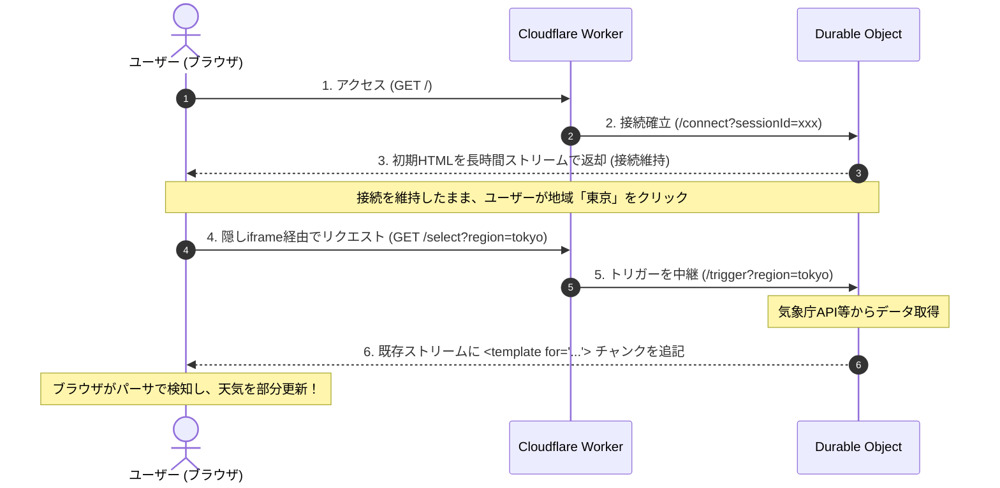

現代のWebフロントエンド開発において、SPAのようなインタラクティブな部分更新を実現するためには、ReactやVue、SvelteといったJavaScriptフレームワークやライブラリをロード・実行することが当たり前となっています。

しかし、ブラウザでJavaScriptが無効化されていたり、JSのダウンロードやハイドレーションによる遅延が発生したりする環境でも、SPAのような画面の部分更新を可能にする新しい実験的機能がChromeでテストされています。

それが **Declarative Partial Updates (DPU)** です。

本記事では、DPUの仕組みと、Cloudflare Workers + Durable Objectsを組み合わせてクライアント側に **JavaScriptを1行も書かずに実現する「順不同ストリーミング天気予報」** のデモコードをもとに、その実装テクニックを解説します。

- **公式ブログ:** [Declarative Partial Updates (Chrome Developer)](https://developer.chrome.com/blog/declarative-partial-updates?hl=ja)
- **デモコード:** [SoraKumo001/out-of-order-streaming2](https://github.com/SoraKumo001/out-of-order-streaming2)


:::message
**注意:** 本デモは標準化前の実験的機能に依存しています。動作確認を行うには、Chrome 148以降で以下のフラグを有効にする必要があります。今後、仕様や構文が変わる可能性があり、他ブラウザでは未対応またはpolyfill前提です。

- `chrome://flags/#enable-experimental-web-platform-features`
  :::

---

# 1. DPU (Declarative Partial Updates) とは？

通常、ブラウザはHTMLを上から順にパースして描画します。しかし、重いデータベースクエリやAPI連携がある場合、その部分のデータが揃うまでページ全体のロードが遅延したり、あるいは初期表示後にクライアントサイドのJavaScriptで非同期にデータを取得してDOMを書き換える必要がありました。

DPUは、HTMLのストリーミング中に**サーバーから送られてきたテンプレートを使って、ブラウザのHTMLパーサ自身にDOMの部分置換（スワップ）を自動でやらせる**技術です。

主要な要素は以下の2つです。

### ① 処理命令によるプレースホルダー（アンカー）

HTMLの中に、スワップ対象となる境界を示すマーカー（Processing Instruction）を配置します。

```html
<?start name="my-content">
<p>読み込み中...</p>
<?end>
```

### ② 差し替え用テンプレート (`<template for="...">`)

あとからストリームで送られてくるHTMLチャンクの中で、`<template>` 要素に `for` 属性を指定します。

```html
<template for="my-content">
  <div>差し替え後のコンテンツ</div>
</template>
```

ブラウザのHTMLパーサがこの `<template for="my-content">` を検知すると、先にレンダリングされていた `<?start name="my-content">` から `<?end>` までの範囲の内容を、テンプレートの中身へ自動的に差し替えます。
この処理はすべてブラウザのパーサ内部で行われるため、クライアントサイドJavaScriptによるDOM操作は一切不要です。

### 実際のストリームの流れ

DPUは「あとから届いたHTML片で、すでに描画済みの場所を更新する」仕組みです。たとえば、最初に以下のHTMLが届いたとします。

```html
<div class="forecast-box">
  <?start name="weather-forecast">
  <p>読み込み中...</p>
  <?end>
  <!-- 接続を維持するため、ここではまだdivを閉じない -->
</div>
```

この時点では、ブラウザには「読み込み中...」が表示されます。その後、同じストリームに以下のチャンクが追記されます。

```html
<template for="weather-forecast">
  <?start name="weather-forecast">
  <p>東京: 晴れ</p>
  <?end>
</template>
```

すると、ブラウザのパーサが `weather-forecast` の範囲を見つけ、表示中の内容をテンプレートの中身へ差し替えます。差し替え後のDOMは、概念的には以下のようになります。

```html
<div class="forecast-box">
  <?start name="weather-forecast">
  <p>東京: 晴れ</p>
  <?end>
  <!-- 接続を維持するため、ここではまだdivを閉じない -->
</div>
```

更新後の中にも同じ `<?start>` / `<?end>` を残しているため、次に大阪のチャンクが届いたときも、同じ場所を再び差し替えられます。

---

# 2. デモアプリのアーキテクチャ

この仕組みを使って「ユーザーがボタンを押したときに、JavaScriptなしで特定のエリアの天気予報だけを差し替える」というSPA風のインタラクティブな画面を構築します。

通信モデルは以下のようになります。



### なぜ Durable Objects が必要なのか？

Cloudflare Workersでもストリーミングレスポンス自体は扱えます。しかし、このデモでは「最初に開いたHTMLレスポンスの `WritableStream` に、あとから別リクエストをきっかけに追記する」必要があります。
Durable Objectsを使用することで、特定のユーザーセッション（`sessionId`）に対応するステートフルなインスタンスをメモリ上に維持し、同じセッションのHTMLストリーム（`WritableStream`）に対して、別リクエストから非同期にデータを書き込むことが可能になります。

---

# 3. デモコード解説

それでは、実際のソースコード（`src/index.ts`）に沿って、重要なテクニックを解説します。

## ① メインストリーム接続を維持するための「隠しiframe」

通常、HTMLのリンク（`<a>`）をクリックすると、ブラウザは別のページに遷移しようとし、現在のページへのストリーミング接続を切断してしまいます。
これを防ぐために、HTML内に**非表示の `<iframe>`** を配置し、リンクの遷移先ターゲットをその `iframe` に指定するハックを用います。

```typescript
function initialHtml(sessionId: string): string {
  return `<!DOCTYPE html>
<html lang="ja">
<head>
  <meta charset="UTF-8">
  <title>JS不要の順不同ストリーミング天気予報</title>
  ...
</head>
<body>
  <h1>天気予報 (ブラウザJS無効)</h1>
  
  <!-- リンクのtarget属性をhidden-iframeに向ける -->
  <ul class="region-list">
    <li><a href="/select?sessionId=${sessionId}&region=tokyo" target="hidden-iframe">東京</a></li>
    <li><a href="/select?sessionId=${sessionId}&region=osaka" target="hidden-iframe">大阪</a></li>
    ...
  </ul>

  <!-- 隠し iframe。ここを通じてリクエストを送信する -->
  <iframe name="hidden-iframe" style="display:none;"></iframe>

  <!-- 初期表示のプレースホルダー。
       このdivを閉じずに接続を維持し、後続の <template for> も同じ親要素内へ流す -->
  <div class="forecast-box">
    <?start name="weather-forecast">
    <p class="placeholder">上の地域を選択してください。ストリーム更新を待機中です。</p>
    <?end>
`;
}
```

ユーザーが「東京」をクリックすると、リクエストは `hidden-iframe` の中で実行されます。メインページの接続は維持されたままであるため、Durable Objectが保持するストリームへ新しいHTMLを追記すれば、それが親ウィンドウ側の画面に即座に反映されます。

ここで重要なのは、DPUの `<template for>` が対象マーカーと**同じ親要素**にストリームされる必要がある点です。そのため、上の例では `forecast-box` を閉じずにストリーム接続を維持し、後続の更新チャンクも同じ `forecast-box` の子として流し込む構造にしています。

## ② 何回でも更新を可能にする「自己修復アンカー」テクニック

DPUの最も重要な挙動として、**「`<template for="xxx">` による置換が行われると、元の `<?start name="xxx">` と `<?end>` マーカー自体もろともコンテンツが丸ごと置き換わる」** という点があります。

つまり、1回目のボタン押下でそのままHTMLを置き換えてしまうと、次のボタンを押したときにはもう `weather-forecast` というマーカーがDOM上に存在しないため、2回目以降の更新ができなくなってしまいます。

これを解決するために、送出する更新チャンク（`weatherChunk`）の中に**全く同じ名前の `<?start>` / `<?end>` マーカーを再配置**します。

```typescript
function weatherChunk(data: WeatherData): string {
  return `
<template for="weather-forecast">
  <!-- 置換後のHTMLの中に、次回のためのマーカーを再配置する -->
  <?start name="weather-forecast">
  <div class="weather-card">
    <h3>${data.name} の天気</h3>
    <p class="desc">${data.weather}</p>
    <p class="temp">${data.temp}</p>
    <p class="time">気象庁API取得時刻: ${data.time}</p>
  </div>
  <?end>
</template>
`;
}
```

この「自己修復アンカー」テクニックにより、同じストリーム接続が維持されている間は、ボタンを押すたびに古い天気が新しい天気で置換され、かつ次の置換のための準備も整います。

なお、実運用でAPIレスポンスやユーザー入力をHTMLへ埋め込む場合は、必ずHTMLエスケープしてください。DPUはHTML片をそのままパースさせる仕組みなので、通常のサーバーサイドHTML生成と同じくXSS対策が必要です。

最低限の例としては、HTMLへ埋め込む直前に以下のようなエスケープ処理を通します。

```typescript
function escapeHtml(value: string): string {
  return value
    .replaceAll("&", "&amp;")
    .replaceAll("<", "&lt;")
    .replaceAll(">", "&gt;")
    .replaceAll('"', "&quot;")
    .replaceAll("'", "&#39;");
}
```

## ③ Durable Object によるストリーム制御

Durable Objects 内では、`IdentityTransformStream` を使用して、レスポンスの `ReadableStream` と、そこにデータを書き込むための `WritableStream`（`writer`）のペアを作成し、メモリに保存します。

```typescript
export class WeatherSessionDO implements DurableObject {
  sessions: Map<string, DoSession>;

  constructor(readonly state: DurableObjectState, readonly env: Env) {
    this.sessions = new Map();
  }

  async fetch(request: Request): Promise<Response> {
    const url = new URL(request.url);
    const sessionId = url.searchParams.get("sessionId");
    if (!sessionId) return new Response("sessionId is required", { status: 400 });
    ...

    // 1. 初回アクセス時の長時間ストリーミング接続
    if (url.pathname === "/connect") {
      const { readable, writable } = new IdentityTransformStream();
      const writer = writable.getWriter();
      this.sessions.set(sessionId, { writer });

      // 初期HTMLを書き込む (接続は切らない)
      writer.write(encoder.encode(initialHtml(sessionId))).catch(() => {
        this.sessions.delete(sessionId);
      });

      return new Response(readable, {
        encodeBody: "manual",
        headers: {
          "Content-Type": "text/html; charset=utf-8",
          "Cache-Control": "no-cache, no-transform",
          "X-Content-Type-Options": "nosniff"
        }
      });
    }

    // 2. 地域が選択された際のトリガー
    if (url.pathname === "/trigger") {
      const region = url.searchParams.get("region");
      const session = this.sessions.get(sessionId);
      if (!session) return new Response(null, { status: 204 });

      // 天気データを取得
      const data = await fetchWeather(region);

      try {
        // 保存しておいた writer を使って、ストリームの末尾にテンプレートを追記
        await session.writer.write(encoder.encode(weatherChunk(data)));
      } catch {
        this.sessions.delete(sessionId);
      }

      // iframeへのレスポンスは 204 No Content を返し、遷移を発生させない
      return new Response(null, { status: 204 });
    }
  }
}
```

レスポンスヘッダに設定されている `Cache-Control: no-cache, no-transform` は重要です。中間プロキシやCDNによる変換・バッファリングを避け、ストリームをできるだけそのまま届ける意図があります。
`X-Content-Type-Options: nosniff` はバッファリング抑止そのものではありませんが、MIME sniffingを抑止し、レスポンスを意図したHTMLとして扱わせるために付けています。

---

# 4. 技術的な注意点と制限

### 親要素のスコープ制限

DPUの仕様として、`<template for="xxx">` は、対象となる `<?start name="xxx">` マーカーと**同じ親要素（同一コンテナ内）**にストリームされる必要があります。階層構造が大きく異なる場所にあるマーカーを更新することはできません。

そのため、更新したい領域を囲むコンテナを先に閉じてしまい、その後ろの `body` 直下などへ `<template for>` を追記しても、対象マーカーを見つけられない場合があります。ストリーミングHTMLの構造として、後続のテンプレートが対象マーカーと同じコンテナに入るように設計する必要があります。

たとえば、以下のように `forecast-box` の中へ後続の `<template for>` が流れる構造なら更新対象になります。

```html
<div class="forecast-box">
  <?start name="weather-forecast">
  <p>読み込み中...</p>
  <?end>

  <template for="weather-forecast">
    <?start name="weather-forecast">
    <p>東京: 晴れ</p>
    <?end>
  </template>
</div>
```

一方で、以下のように対象マーカーを含む `forecast-box` を閉じたあと、外側へ `<template for>` を流してしまう構造は避けるべきです。

```html
<div class="forecast-box">
  <?start name="weather-forecast">
  <p>読み込み中...</p>
  <?end>
</div>

<template for="weather-forecast">
  <p>東京: 晴れ</p>
</template>
```

この制約があるため、DPUのストリーミングHTMLでは「どこに追記されるか」を通常のHTML生成より意識する必要があります。

### ローカル開発環境の差異

Cloudflareのローカル開発ツールである `wrangler dev` では、HTMLのストリーミングや宣言型部分更新のバッファ挙動がエッジサーバー（本番）と若干異なる場合があります。ローカルでストリームが途中で止まって見えたりする場合でも、本番のWorkersにデプロイすると正しく動作することが多いため、最終確認はデプロイ先で行うのが推奨されます。

### 接続が切れた場合の扱い

このデモは、最初に開いたHTMLレスポンスのストリームが維持されていることを前提にしています。ブラウザの再読み込み、タブの破棄、ネットワーク切断、Durable Object側での `writer.write()` 失敗などが発生すると、そのセッションのストリームには追記できなくなります。

サンプルコードでは `writer.write()` の失敗時に `sessions.delete(sessionId)` を行っています。これは、すでに使えなくなった `writer` を保持し続けないためです。実運用に近づけるなら、再接続時に新しい `sessionId` を発行する、古いセッションを期限付きで掃除する、UI上で再読み込みを促す、といった設計が必要になります。

### このデモでやっていないこと

このデモはDPUの挙動を見せるための最小構成です。そのため、一般的なSPAで期待されるすべての機能を実装しているわけではありません。

- URL履歴や戻る/進むの状態管理
- 接続断からの自動復旧
- 複数タブや複数デバイス間の同期
- 本格的な認証・認可
- APIレスポンスの厳密なHTMLエスケープ
- Chrome以外のブラウザ対応

これらを含めて作り込む場合は、DPUだけで完結させるのではなく、要件に応じて通常のフォーム遷移、SSE、HTMX、クライアントJavaScriptなどと比較して選ぶのが現実的です。

### 他のアプローチとの違い

DPUの立ち位置をざっくり比較すると、以下のようになります。

| アプローチ | クライアントJS | 更新方法                                           | 特徴                                                     |
| ---------- | -------------- | -------------------------------------------------- | -------------------------------------------------------- |
| 通常のSPA  | 必要           | `fetch()` 後にDOM更新                              | 柔軟だが、JSバンドルと状態管理が必要                     |
| HTMX       | 必要           | サーバーHTML片を取得してDOM更新                    | HTML中心で書けるが、HTMXのJS実行は必要                   |
| SSE        | 多くの場合必要 | イベントを受けてDOM更新                            | サーバーからのpushに強いが、描画処理は別途必要           |
| DPU        | 不要           | ストリーム中の `<template for>` をHTMLパーサが処理 | ブラウザネイティブに部分更新できるが、現時点では実験機能 |

---

# 5. まとめ

Declarative Partial Updates (DPU) を使うことで、ブラウザ標準のパーサの力だけで以下のようなメリットを享受できるようになります。

1. **ゼロ・JavaScript**: クライアント用のJSバンドルをダウンロード・パース・実行するオーバーヘッドが一切ない。
2. **高速なインタラクティブ性**: サーバー側でHTML片を組み立てて送るだけで、SPA風に画面の一部を切り替えられる。
3. **サーバー主導のUI**: サーバーサイドで状態管理とUI構築を完結できるため、APIエンドポイントの設計やクライアント側での状態同期処理から解放される。

現在はまだ実験的機能ですが、これが標準化されれば、React Server Componentsのストリーミング実装や、HTMXのようなアプローチがブラウザネイティブの機能だけで非常にシンプルに実装できるようになる未来が期待されます。
興味のある方は、ぜひChromeの実験フラグを有効化して、Durable Objectsでのストリーミング部分更新の可能性を体験してみてください。
