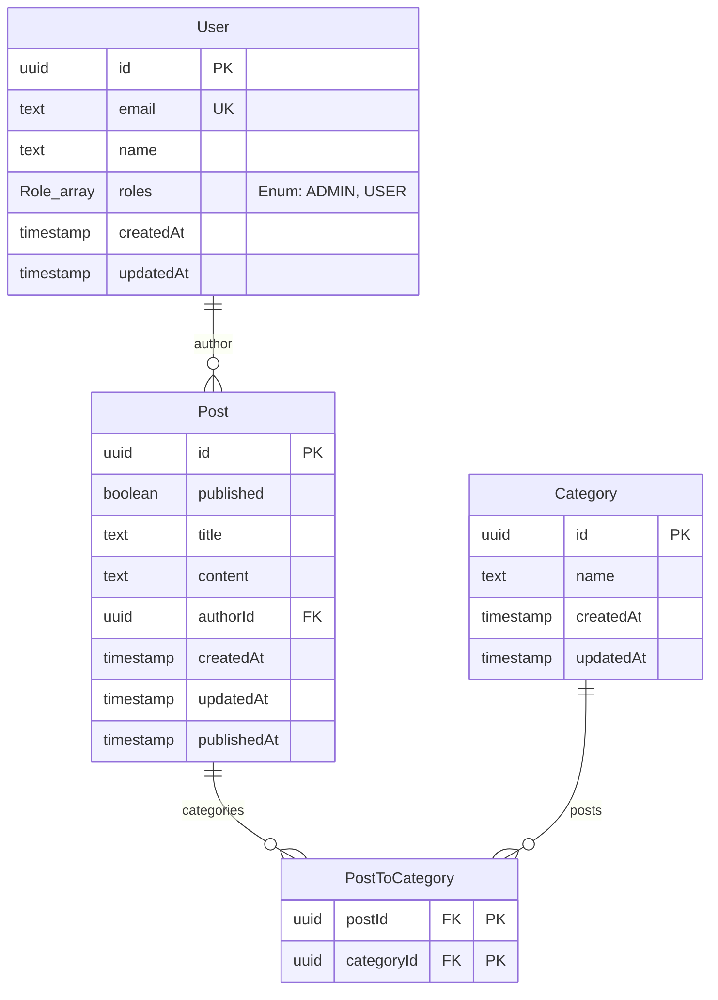

# Drizzle Relational Queries version 2

Drizzle@1.00β によって、Drizzle ORM の Relational Queries (RQ) が version 2 へとアップデートされました。
これは、SQL を直接的に扱うことを重視してきた Drizzle が、開発者体験 (DX) を向上させるために高レベルな抽象化を取り入れた重要な進化です。

この記事では、公式ドキュメントおよび Prisma が提唱する「ORM Convergence（ORM の収束）」という観点から、RQ v2 の変更点とその背景を解説します。

## 背景：ORM Convergence（ORM の収束）

Prisma のブログ記事 [The ORM Convergence](https://www.prisma.io/blog/convergence) では、**「異なる哲学から始まった ORM であっても、プロダクションレベルの課題に直面すると、似たような解決策（機能・API）に収束していく」** という興味深い現象が指摘されています。

- **Prisma:** スキーマ駆動で、直感的なオブジェクトベースの API からスタート。
- **Drizzle:** "If you know SQL, you know Drizzle" を掲げ、SQL に近い操作性を重視してスタート。

しかし、アプリケーションが複雑化し、リレーションを含むデータを効率的に取得する必要が出てくると、生の SQL や単純なクエリビルダだけでは記述が冗長になりがちです。
Drizzle RQ v2 は、Prisma が開拓した **「オブジェクトベースのクエリ構文（Include や Select のようなパターン）」** を採用することで、複雑なデータ取得を宣言的かつ直感的に記述できるようにしました。

これは Drizzle が「SQL ファースト」を捨てたわけではなく、**「SQL の制御力」と「モダンな DX」のいいとこ取り** を目指した結果と言えます。

## v1 から v2 への主な変更点

[Drizzle の公式ドキュメント](https://orm.drizzle.team/docs/relations-v1-v2) に基づき、具体的な変更点を見ていきます。

### 1. リレーション定義の一元化と構文変更

v1 ではテーブル定義の直後にリレーションを記述していましたが、v2 では `relations` 関数を使ってより整理された形で定義できるようになりました。また、パラメータ名が直感的に変更されています。

**変更点:**

- **パラメータ名:** `fields` / `references` が **`from` / `to`** に変更されました。視覚的に「どこからどこへ」結合するかが分かりやすくなっています。
- **Many-to-Many の簡素化:** 中間テーブルを意識せずに記述できる `through` オプションが導入されました。

```typescript
// v2 でのリレーション定義例
import { relations } from "drizzle-orm";

export const usersRelations = relations(users, ({ many }) => ({
  posts: many(posts),
}));

export const postsRelations = relations(posts, ({ one }) => ({
  author: one(users, {
    fields: [posts.authorId],
    references: [users.id],
  }),
}));
```

### 2. クエリ構文のオブジェクト化

これが最大の変化です。v1 ではコールバック関数を多用していましたが、v2 では Prisma ライクなオブジェクト形式で `where`, `orderBy`, `with` (リレーション取得\) を記述できます。

**v1 のスタイル (Callback ベース):**

```typescript
const result = await db._query.users.findMany({
  where: (users, { eq }) => eq(users.id, 1),
  with: {
    posts: true,
  },
});
```

**v2 のスタイル (Object ベース):**

```typescript
const result = await db.query.users.findMany({
  where: {
    id: 1,
  },
  with: {
    posts: {
      limit: 10,
      orderBy: { createdAt: "desc" }, // オブジェクト内で完結
    },
  },
});
```

v2 では、ネストしたリレーションに対しても `limit` や `offset`、フィルタリングを直感的に適用できるようになっています。

### 3. Many-to-Many の大幅な改善

v1 では Many-to-Many リレーションを扱う際に、中間テーブルを手動で結合したりマップしたりする必要がありましたが、v2 では `through` を使うことで、直接関連エンティティを取得・フィルタリングできるようになりました。

### 4. その他

- **必須リレーション:** `optional: false` を指定することで、TypeScript の型レベルでリレーションが存在することを保証できるようになりました。
- **マイグレーション:** 既存の v1 コードも動作するように後方互換性が考慮されていますが、新しい機能を使うには v2 構文への移行が推奨されます。

## Pothos と Drizzle Plugin

Drizzle RQ v2 の進化は、GraphQL サーバー構築においても大きなメリットをもたらします。とくに TypeScript 製の Code-first GraphQL スキーマビルダーである **Pothos** との組み合わせが強力です。

### Pothos とは？

[Pothos](https://pothos-graphql.dev/) は、型安全性と開発者体験（DX）を最優先に設計された TypeScript 向けの GraphQL スキーマビルダーです。
自動生成に頼らず、TypeScript の強力な型推論を活用してコードベースでスキーマを定義していくスタイルが特徴で、Prisma との親和性が高いことでも知られています。

### @pothos/plugin-drizzle

Pothos には公式の [Drizzle プラグイン](https://pothos-graphql.dev/docs/plugins/drizzle) が用意されており、Drizzle RQ v2 の機能をフル活用して GraphQL API を効率的に構築できます。

主な特徴は以下の通りです：

1.  **Drizzle スキーマからの型定義:** Drizzle のテーブル定義を元に GraphQL の Object Type を簡単に定義できます。型情報は自動的に推論されるため、手動で型を書く手間が省けます。
2.  **クエリの最適化 (N+1 問題の解決):** GraphQL クエリで要求されたフィールドやリレーションだけをデータベースから取得するように、Drizzle のクエリを自動的に構築します。これは Drizzle RQ の `with` 構文などを活用して行われ、過剰なデータ取得を防ぎます。
3.  **Relay スタイルのサポート:** Relay 準拠の Connection や Global ID (Node インターフェイス\) を簡単に実装できるヘルパーが提供されています。

### 実装イメージ

プラグインを利用すると、以下のように Drizzle のスキーマ定義を直接参照して GraphQL の型を定義できます。

```typescript
import { builder } from "./builder";
import { users } from "./db/schema";

// Drizzle のテーブル定義 (users) から GraphQL Object Type を作成
builder.drizzleObject("users", {
  fields: (t) => ({
    id: t.exposeID("id"),
    name: t.exposeString("name"),
    // リレーションも簡単に定義可能
    posts: t.relation("posts", {
      // 必要な引数やソート順なども指定可能
      args: {
        limit: t.arg.int(),
      },
      query: (args, context) => ({
        limit: args.limit ?? 10,
        orderBy: { createdAt: "desc" },
      }),
    }),
  }),
});
```

このように、Drizzle RQ v2 の表現力と Pothos の型安全性を組み合わせることで、非常に効率的かつ堅牢な GraphQL API 開発が可能になります。

## GraphQL API の自動構築

さらに開発を加速させるツールとして、[pothos-drizzle-generator](https://github.com/node-libraries/pothos-drizzle-generator) というライブラリを作成しました。

これは、Drizzle のスキーマ定義を読み取り、**Pothos の GraphQL スキーマ定義コードを自動生成する** ライブラリです。
手動で `builder.drizzleObject` を個別に定義していく手間を大幅に削減できます。

### 主な機能

- **全テーブルの自動型定義:** Drizzle スキーマに含まれるすべてのテーブルに対して、GraphQL Object Type を自動生成します。
- **リレーションの自動解決:** `relations` で定義されたリレーションも自動的に GraphQL フィールドとして追加されます。
- **CRUD オペレーションの生成:** 設定によっては、基本的な Query や Mutation (CRUD) も自動生成可能です。

### 使用イメージ

Pothos のビルダー初期化時にプラグインとして追加するだけで利用できます。

```typescript
import SchemaBuilder from "@pothos/core";
import DrizzlePlugin from "@pothos/plugin-drizzle";
import { PothosDrizzleGeneratorPlugin } from "pothos-drizzle-generator";
import { db } from "./db";
import * as schema from "./db/schema";

const builder = new SchemaBuilder({
  plugins: [DrizzlePlugin, PothosDrizzleGeneratorPlugin],
  drizzle: {
    client: db,
    schema: schema,
  },
  pothosDrizzleGenerator: {
    //...カスタマイズオプション
  },
});

// これだけでGraphQLのスキーマが自動構築される
export const schema = builder.toSchema();
```

このように、Drizzle RQ v2 でデータベーススキーマとリレーションをしっかり定義しておけば、GraphQL API の大部分を自動で構築できる環境を構築できます。
「まずは自動生成でベースを作り、必要な部分だけ Pothos で手動拡張する」というハイブリッドな開発が行えます。

## 具体的な実装サンプル

実際のプロジェクトでの構成イメージを掴むために、[SoraKumo001/pothos-drizzle-generator-sample](https://github.com/SoraKumo001/pothos-drizzle-generator-sample) から、具体的な実装方法を紹介します。

このサンプルは、**Hono**, **Drizzle ORM**, **Pothos**, そして **pothos-drizzle-generator** を組み合わせ、セキュアで型安全な GraphQL API を構築する実践的な例です。動作の確認は Apollo Explorer で行います。


### 1. プロジェクト構成

主要なファイル構成は以下のようになっています。Drizzle の定義と Pothos の設定が明確に分かれています。この分離により、データベースのスキーマ変更が API 定義に与える影響を管理しやすくなります。

```text
src/
├── db/
│   ├── schema.ts      # Drizzle テーブル定義 (データ構造)
│   └── relations.ts   # Drizzle リレーション定義 (テーブル間の関係)
├── builder.ts         # Pothos ビルダー設定 (プラグイン設定とセキュリティ定義)
├── context.ts         # コンテキスト定義 (ユーザー情報など)
└── index.ts           # Hono サーバーのエントリーポイント
```

### 2. Drizzle スキーマとリレーションの定義

データモデルの定義は Drizzle ORM の中核です。v2 構文を用いて、テーブルとリレーションを定義します。

**ER 図**

まず、作成するデータモデルの全体像を把握しましょう。ユーザーが記事を投稿し、その記事に複数のカテゴリを付与できる一般的なブログシステムの構成です。



**テーブル定義 (`src/db/schema.ts`)**

Drizzle ORM を使用してテーブル定義を行います。ここでは PostgreSQL を想定していますが、Drizzle は他のデータベースもサポートしています。`pgTable` を使用してテーブルの構造を定義し、各カラムの型や制約（`notNull`, `default`, `primaryKey` など）を設定します。

```typescript
// src/db/schema.ts
import {
  pgTable,
  uuid,
  text,
  boolean,
  timestamp,
  pgEnum,
  primaryKey,
} from "drizzle-orm/pg-core";

// ユーザーロールを定義するEnum
export const roleEnum = pgEnum("Role", ["ADMIN", "USER"]);

// 'User'テーブル
export const users = pgTable("User", {
  id: uuid().defaultRandom().primaryKey(),
  email: text().notNull().unique(),
  name: text().notNull().default("User"),
  roles: roleEnum().array().default(["USER"]).notNull(),
  createdAt: timestamp({ withTimezone: true }).defaultNow().notNull(),
  updatedAt: timestamp({ withTimezone: true }).defaultNow().notNull(),
});

// 'Post'テーブル
export const posts = pgTable("Post", {
  id: uuid().defaultRandom().primaryKey(),
  published: boolean().notNull().default(false),
  title: text().notNull().default("New Post"),
  content: text().notNull().default(""),
  authorId: uuid().references(() => users.id, { onDelete: "cascade" }), // 外部キー
  createdAt: timestamp({ withTimezone: true }).defaultNow().notNull(),
  updatedAt: timestamp({ withTimezone: true }).defaultNow().notNull(),
  publishedAt: timestamp({ withTimezone: true }).defaultNow().notNull(),
});

// 'Category'テーブル
export const categories = pgTable("Category", {
  id: uuid().defaultRandom().primaryKey(),
  name: text().notNull(),
  createdAt: timestamp({ withTimezone: true }).defaultNow().notNull(),
  updatedAt: timestamp({ withTimezone: true }).defaultNow().notNull(),
});

// 'PostToCategory' 中間テーブル (多対多)
export const postsToCategories = pgTable(
  "PostToCategory",
  {
    postId: uuid()
      .notNull()
      .references(() => posts.id, { onDelete: "cascade" }),
    categoryId: uuid()
      .notNull()
      .references(() => categories.id, { onDelete: "cascade" }),
  },
  (t) => [primaryKey({ columns: [t.postId, t.categoryId] })] // 複合主キー
);
```

**リレーション定義 (`src/db/relations.ts`)**
Drizzle RQ v2 の重要な機能であるリレーション定義です。`relations` 関数を使い、テーブル間の関係性を一元管理します。これにより、GraphQL クエリでネストされたデータを取得する際（例: `posts` と一緒に `author` を取得）、Drizzle が適切な JOIN クエリを生成できるようになります。

```typescript
// src/db/relations.ts
import { defineRelations } from "drizzle-orm";
import * as schema from "./schema.js";

export const relations = defineRelations(schema, (r) => ({
  // Userは複数のPostを持つ (One-to-Many)
  users: {
    posts: r.many.posts({
      from: r.users.id,
      to: r.posts.authorId,
    }),
  },
  // Postは一人のUser(author)と複数のCategoryを持つ
  posts: {
    author: r.one.users({
      from: r.posts.authorId,
      to: r.users.id,
    }),
    categories: r.many.categories({
      from: r.posts.id.through(r.postsToCategories.postId),
      to: r.categories.id.through(r.postsToCategories.categoryId),
    }),
  },
  // Categoryは複数のPostを持つ
  categories: {
    posts: r.many.posts(),
  },
  // 中間テーブルのリレーション定義
  postsToCategories: {
    post: r.one.posts({
      from: r.postsToCategories.postId,
      to: r.posts.id,
    }),
    category: r.one.categories({
      from: r.postsToCategories.categoryId,
      to: r.categories.id,
    }),
  },
}));
```

### 3. Generator の設定とセキュリティ制御

`src/builder.ts` では、Pothos のスキーマビルダーを初期化し、`PothosDrizzleGeneratorPlugin` を設定します。
このプラグインの真価は、単に API を自動生成するだけでなく、**「誰が」「どのデータに」アクセスできるか** というセキュリティルール（Authorization）をコードベースで柔軟に定義できる点にあります。

```typescript
// src/builder.ts
const builder = new SchemaBuilder<PothosTypes>({
  plugins: [DrizzlePlugin, PothosDrizzleGeneratorPlugin],
  pothosDrizzleGenerator: {
    // 1. グローバルな実行制御
    // 未認証ユーザーによる Mutation (書き込み操作) を全面的に禁止します。
    // これにより、個別のリゾルバで認証チェックを行う手間が省けます。
    executable: ({ operation, ctx }) => {
      if (operation === "mutation" && !ctx.user) return false;
      return true;
    },

    // 2. 行レベルセキュリティ (RLS) のようなフィルタリング
    // クエリやミューテーションの実行時に、自動的に WHERE 句を追加してアクセス制御を行います。
    where: ({ ctx, operation }) => {
      // Query: 公開済みの記事、または自分が作成した記事のみを取得可能にします。
      // 下書き記事が他人の目に触れるのを防ぎます。
      if (operation === "query") {
        return {
          OR: [{ authorId: ctx.user?.id }, { published: true }],
        };
      }
      // Mutation: 自分の記事のみを操作（更新・削除）可能にします。
      if (operation === "mutation") {
        return { authorId: ctx.user?.id };
      }
    },

    // 3. データ挿入時の自動入力
    // 新規作成時、クライアントからの入力を待たずに、サーバー側で値を強制的にセットします。
    // ここでは、記事作成時に authorId にログインユーザーの ID を自動セットしています。
    inputData: ({ ctx }) => {
      return { authorId: ctx.user?.id };
    },
  },
});
```

### 4. Hono サーバーとの統合

`src/index.ts` で Hono サーバーを立ち上げ、GraphQL エンドポイントを作成します。
Hono のミドルウェア機能を利用して JWT 認証を行い、その結果（ユーザー情報）を GraphQL のコンテキスト（`ctx`）に注入します。これにより、先ほどの `builder.ts` 内で `ctx.user` を利用できるようになります。

```typescript
// src/index.ts
const app = new Hono();

// 認証ミドルウェア:
// リクエストヘッダーやCookieからトークンを取得し、検証します。
// 検証に成功すれば、ユーザー情報をコンテキストにセットします。
app.use(async (c, next) => {
  const token = getCookie(c, "auth-token");
  const user = await verifyToken(token); // 擬似コード: 実際にはJWT検証ロジックが入ります
  c.set("user", user);
  await next();
});

// GraphQL エンドポイント
// 生成されたスキーマを用いてGraphQLリクエストを処理します。
app.post("/", (c) => {
  return graphqlServer({ schema })(c);
});

// 開発用: ブラウザで開くと Apollo Explorer が起動
// 開発中はブラウザから手軽にクエリを試すことができます。
app.get("/", (c) => {
  return c.html(explorer({ endpointUrl: "/" }));
});
```

### 5. 生成される API の利用例

`pothos-drizzle-generator`により、定義したモデル（`users`, `posts`, `categories`）に基づいて、以下の GraphQL 操作が自動的に生成されます。開発者はリゾルバをひとつひとつ手書きする必要はありません。

- **クエリ (Read)**:

  - `findMany*`: 複数件のレコードを取得します。（例: `findManyUsers`）
  - `findFirst*`: 条件に一致する最初の 1 件を取得します。（例: `findFirstPost`）
  - `count*`: 条件に一致するレコード数を取得します。（例: `countPosts`）

- **ミューテーション (Create/Update/Delete)**:

  - `create*`: 新しいレコードを作成します。（例: `createPost`）
  - `update*`: 既存のレコードを更新します。（例: `updatePost`）
  - `delete*`: レコードを削除します。（例: `deletePost`）

- **強力なフィルタリング**:
  クエリでは、`AND`, `OR`, `NOT`, `eq` , `ne`, `gt`, `gte`, `lt`, `lte` , `like`, `in` など、SQL に匹敵する柔軟なフィルタ条件が利用可能です。

このセットアップにより、以下のような高度な GraphQL 操作がすぐに利用可能になります。

#### クエリ例: 公開記事の取得

まずはデータを取得するクエリの例です。
ここでは、「公開されている記事（`published: true`）」を「作成日時の降順（`orderBy: { createdAt: Desc }`）」で取得しています。
同時に、その記事の「著者名（`author { name }`）」もリレーション経由で取得しています。

```graphql
query {
  findManyPost(
    where: { published: { eq: true } }
    orderBy: { createdAt: Desc }
  ) {
    id
    title
    createdAt
    author {
      name
    }
  }
}
```

**生成された SQL**

このクエリに対して生成される SQL は以下のようになります。
重要な点は、**`LEFT JOIN LATERAL` を使用して、記事データと著者データを 1 回のクエリで効率的に取得している** ことです。
これにより、GraphQL でよくある「N+1 問題（親データの数だけ子データの取得クエリが走ってしまう問題）」を回避し、高いパフォーマンスを実現しています。

```sql
SELECT
  "d0"."id" AS "id",
  "d0"."title" AS "title",
  "d0"."createdAt" AS "createdAt",
  "author"."r" AS "author"
FROM
  "Post" AS "d0"
  LEFT JOIN LATERAL (
    SELECT
      row_to_json("t".*) "r"
    FROM
      (
        SELECT
          "d1"."name" AS "name"
        FROM
          "User" AS "d1"
        WHERE
          "d0"."authorId" = "d1"."id"
        LIMIT
          1 /*$1*/
      ) AS "t"
  ) AS "author" ON TRUE
WHERE
  (
    "d0"."published" = true /*$2*/
    AND "d0"."published" = true /*$3*/
  )
ORDER BY
  "d0"."createdAt" DESC;
```

#### ミューテーション例: 記事の作成

次はデータを新規作成するミューテーションです。
入力パラメータ (`input`) には `title`, `content`, `published` だけを指定しています。
テーブル定義では `authorId` が必須ですが、`builder.ts` で設定した `inputData` により、サーバー側でログイン中のユーザー ID が自動的に挿入されます。

```graphql
mutation {
  createOnePost(
    input: {
      title: "Pothos と Drizzle の連携"
      content: "コンテンツ"
      published: true
    }
  ) {
    id
    author {
      name
    }
  }
}
```

**動作 1: サインインしていない場合**

`builder.ts` の `executable` 設定により、未認証ユーザー（`ctx.user` が存在しない場合）の Mutation はブロックされます。
そのため、以下のような「No permission」エラーが返ります。これにより、個別に権限チェックを書かなくてもセキュアな API が保たれます。

```json
{
  "errors": [
    {
      "message": "No permission",
      "locations": [
        {
          "line": 2,
          "column": 3
        }
      ],
      "path": ["createOnePost"]
    }
  ]
}
```

**動作 2: サインインしている場合**

認証済みであれば、トランザクション内で `INSERT` が実行されます。
`INSERT` 文の `VALUES` を見ると、4 番目のパラメータとしてユーザー ID (`ab2f7431-...`) が自動的にセットされていることがわかります。

```sql
BEGIN;
--
INSERT INTO
  "Post" ("id", "published", "title", "content", "authorId", "createdAt", "updatedAt", "publishedAt")
VALUES
  (
    DEFAULT,
    true /*$1*/,
    'Pothos と Drizzle の連携' /*$2*/,
    'コンテンツ' /*$3*/,
    'ab2f7431-0e7a-4ebf-9ef0-728a4e5a8f59' /*$4*/,
    DEFAULT,
    DEFAULT,
    DEFAULT
  )
RETURNING
  "id";
--
COMMIT;
--
-- 続けて、レスポンスに必要なデータを取得するSELECTが走ります
SELECT
  "d0"."id" AS "id",
  "author"."r" AS "author"
FROM
  "Post" AS "d0"
...
```

#### ミューテーション例: 記事の更新 (ManyToMany リレーションの操作)

Drizzle RQ v2 の強力な点は、中間テーブル（`PostToCategory`）を意識せずに、多対多のリレーションを直感的に更新できることです。
以下の例では、`categories` フィールドに対して `set` を使い、その記事に関連付けたいカテゴリの ID リストを渡しています。

```graphql
mutation {
  updatePost(
    where: { id: { eq: "4493c608-fa6c-4cc4-9346-9f41bbc48bd4" } }
    input: {
      title: "更新されたタイトル"
      categories: {
        set: [
          { id: "663f796b-7ec0-4cda-8484-af8fe4197463" }
          { id: "7d503606-1c2b-479d-a0e6-597d46836e3c" }
        ]
      }
    }
  ) {
    id
    title
    updatedAt
    categories {
      name
    }
  }
}
```

**生成される SQL**

この操作ひとつで、以下の処理がトランザクション内で自動的に行われます。

1.  `Post` テーブル自体の更新 (`UPDATE "Post" ...`)
2.  古いカテゴリ関連付けの削除 (`DELETE FROM "PostToCategory" ...`)
3.  新しいカテゴリ関連付けの挿入 (`INSERT INTO "PostToCategory" ...`)

これらを手動で実装するのは非常に手間がかかりますが、自動生成された API ならクライアントから直感的なパラメータを送るだけで完結します。

```sql
BEGIN;
-- 1. 記事本体の更新
UPDATE "Post"
SET
  "title" = '更新されたタイトル' /*$1*/,
  "authorId" = 'ab2f7431-0e7a-4ebf-9ef0-728a4e5a8f59' /*$2*/
WHERE ...
RETURNING ...;
-- 2. 古い関連の削除
DELETE FROM "PostToCategory"
WHERE
  "PostToCategory"."postId" = '4493c608-fa6c-4cc4-9346-9f41bbc48bd4' /*$1*/;
-- 3. 新しい関連の挿入
INSERT INTO
  "PostToCategory" ("postId", "categoryId")
VALUES
  ('4493c608-fa6c-4cc4-9346-9f41bbc48bd4' /*$1*/, '663f796b-7ec0-4cda-8484-af8fe4197463' /*$2*/),
  ('4493c608-fa6c-4cc4-9346-9f41bbc48bd4' /*$3*/, '7d503606-1c2b-479d-a0e6-597d46836e3c' /*$4*/);
--
COMMIT;
...
```

#### ミューテーション例: 記事の削除

記事の削除もシンプルです。削除したい記事の ID を `where` 条件で指定します。
ここでも `builder.ts` の `where` 設定（自分の記事しか操作できない）が効いているため、他人の記事を勝手に削除することはできません。

```graphql
mutation {
  deletePost(where: { id: { eq: "uuid-of-the-post" } }) {
    id
  }
}
```

#### 認証フローの確認

最後に、このサンプルで実装されている認証フローを確認するためのミューテーションです。

**サインイン**

メールアドレスを送信してサインインします（サンプルなのでパスワードレスです）。
成功すると、サーバーは `Set-Cookie` ヘッダーを使って HTTP-only Cookie に JWT トークンを保存します。これにより、以降のすべてのリクエストで自動的に認証情報が送信されるようになります。

```graphql
mutation {
  signIn(email: "redolent_osie@msn.com") {
    id
    email
    name
    roles
  }
}
```

**現在のユーザー情報の取得 (Me)**

現在サインインしているユーザー自身の情報を取得します。
Cookie が正しく送信され、サーバー側で JWT が検証されているかを確認するのに便利です。

```graphql
mutation {
  me {
    id
    email
    roles
  }
}
```

**サインアウト**

サインアウトして、ブラウザの Cookie をクリアします。

```graphql
mutation {
  signOut
}
```

## まとめ

このように、**pothos-drizzle-generator** を使用することで、Drizzle ORM で定義したスキーマから、実用的な GraphQL API を瞬時に構築できます。

- **型安全性:** TypeScript による完全な型補完
- **高パフォーマンス:** Drizzle RQ v2 による最適化された SQL 生成
- **高い生産性:** CRUD やリレーション操作の自動生成による工数削減
- **柔軟なセキュリティ:** コードベースで定義できる詳細なアクセス制御

あとは Drizzle の正式版リリースを待つばかりです。
