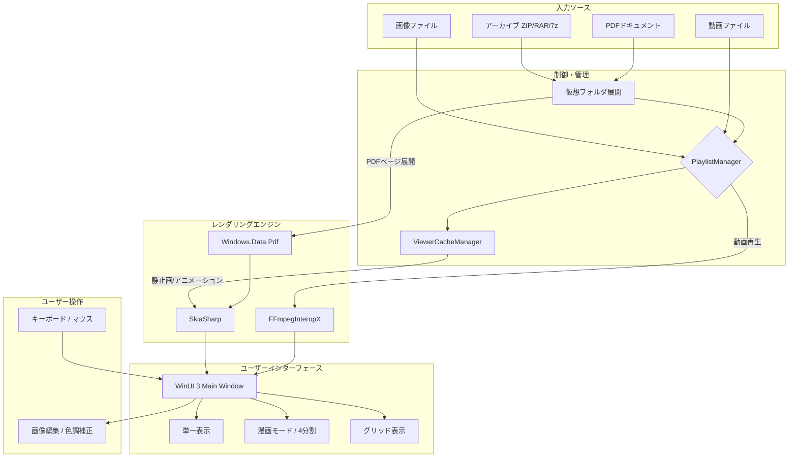

# WinUI 3 で作る Windows 用マルチメディア Viewer `Quick Image Viewer` の開発

画像を表示するのに愛用しているフリーソフトがあります。[MassiGra](http://www.massigra.net/)というアプリですが。残念ながら10年以上更新されていません。仕方がないので自分で同じような操作感のViewrを作ることにしました。

最近のWindowsネイティブ開発はさっぱり行っておらず、最後に作ったのはそこそこ前に作った[WPF](https://learn.microsoft.com/ja-jp/dotnet/desktop/wpf/overview/)の並列動画再生ソフトでした。現在の最新のライブライは[WinUI 3](https://learn.microsoft.com/ja-jp/windows/apps/winui/winui3/)のようだったので、それを使って開発を始めました。

## 作成したもの

- Microsoft Store: [入手はこちら](https://apps.microsoft.com/detail/9ns97p3lfqws)
- GitHub Releases: [最新バージョン](https://github.com/SoraKumo001/quick-image-viewer/releases)

## 動作画面

素材フリーで使えるデータで思いついたのがこれ。途中で2分割と4分割に切り替えています。PDFは縦スクロールよりも見開きページ切り替えのほうが見やすいと感じました。

## 開発時の要件

- [MassiGra](http://www.massigra.net/) のように高速起動かつ
- 画面にごちゃごちゃ余計なものを載せない
- 起動時のスプラッシュスクリーンなど論外
- キーボードでサクサク画像を切り替えられる
- 見開き漫画モード対応

## WinUI 3 に関して

[WinUI 3](https://learn.microsoft.com/ja-jp/windows/apps/winui/winui3/)は、マイクロソフトが提供するWindowsアプリケーション開発用のUIフレームワークです。WPFの進化版だと思って触ったら、初っ端から手痛い洗礼を受けました。GUIのコンポーネント配置機能がありません。xamlをテキストで記述してレイアウトやコンポーネントの配置を決める構造です。一から始めるのには敷居がチョモランマです。もはやAIを召喚するしかありません。

## 画像表示

画像を読み込んで表示するだけなら簡単です。ただ、アニメーションWebPなどに対応するには標準機能では対応できないのでGoogleの提供するグラフィックライブラリのSkiaSharpを導入しました。Skiaに関してはHTMLをイメージに変換する[Satoru](https://github.com/SoraKumo001/satoru)や画像変換ライブラリの[wasm-image-optimization](https://github.com/node-libraries/wasm-image-optimization)で利用したことがあります。今回はC#からまたお世話になりました。

## 画像編集

明るさや色調補正、切り抜きなどに対応させました。MassiGra に編集機能がついていたので実装していますが、私はあまり必要性を感じてません。

## 動画の読み込み

アニメーション画像に対応したところで、いっそ動画も表示できるようにしようと思い立ちました。標準コンポーネントでも動画再生は可能なのですが、FFmpegInteropXを導入して、対応フォーマットを増やすことにしました。

動画再生自体はそれほど難しくはないのですが、並列で動画を再生し、それを高速で切り替えたらアプリどころかGPUがハングアップする事態が頻発しました。高速化のためにUIと画像のデコードがそれぞれマルチスレッド化しておりそれが仇になりました。WinUI 3はDirect3D12ベースで動くのですが、どうやら動画絡みの処理でGPUリソースをぶっ壊している状態になっているらしく、かなり不安定でした。最終的にMediaPlayerElementを使い回さないようにしたら安定しました。

この時点で画像Viewerを作っていたはずなのに、マルチメディアViwerと化しました。

## アーカイブのサポート

圧縮されているファイルの中の画像も、仮想フォルダ扱いにして画像を表示できるようにしました。

## PDFのサポート

PDFもアーカイブファイルに近い構造で画像扱いできるようにしました。PDFはページごとに画像として扱っています。

## 構造図

## 現時点での対応フォーマット

| カテゴリ     | 対応フォーマット                                                                                                                     |
| ------------ | ------------------------------------------------------------------------------------------------------------------------------------ |
| 画像         | `.jpg`, `.jpeg`, `.png`, `.bmp`, `.gif`, `.webp`, `.avif`, `.heic`, `.heif`, `.jxl`, `.tif`, `.tiff`, `.svg`, `.ico`, `.tga`, `.pcx` |
| RAW 画像     | `.dng`, `.nef`, `.cr2`, `.arw`                                                                                                       |
| 動画         | `.mp4`, `.mkv`, `.mov`, `.avi`, `.wmv`, `.flv`, `.webm`, `.avis`                                                                     |
| 圧縮ファイル | `.zip`, `.cbz`, `.rar`, `.cbr`, `.7z`                                                                                                |
| その他       | `.pdf`, `.psd`                                                                                                                       |

## その他

スライドショーや画像一覧表示用のグリッドモードなどを付けました。また、ブックマーク機能もあります。ブックマーク機能は開発時のテストで地味に役に立ちました。

## ストアへの公開

WinUI 3のアプリは、VisualStudioから公開用パッケージがストレートに作成できるので、あとはそれをストアにアップロードして各種情報を登録すればリリースできます。

注意点として、WinUI 3の権限を過剰に要求すると登録がリジェクトされます。今回のアプリはただのデスクトップアプリなので、ファイルアクセスなどは通常のAPIを使って行うことが可能です。逆にWinUI 3専用のファイルアクセス機能を使いその権限を要求すると、同じことをしているだけなのに何故かリジェクト対象となります。

## まとめ

いつもはWeb開発ばかりなのですが、久々にネイティブアプリを作りました。感想としてはUIの作成は慣れているWebの方が圧倒的に作りやすかったというところです。
