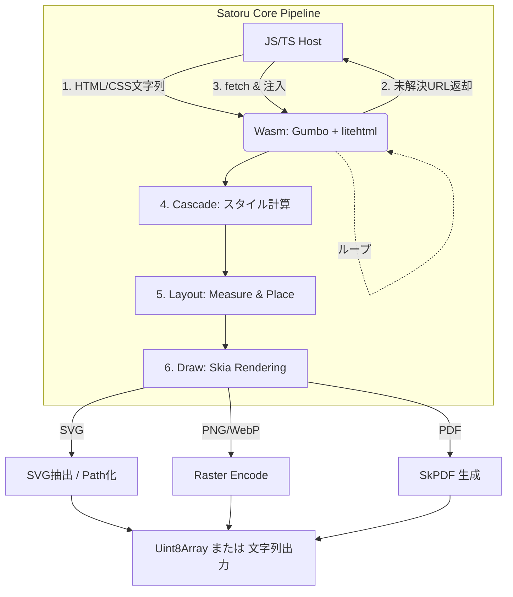

# HTMLをイメージに変換する方法：Satoruの内部アーキテクチャ詳細

https://www.npmjs.com/package/satoru-render

Satoruは、WebAssembly（Wasm）上で動作する高パフォーマンスなHTML変換エンジンです。ブラウザのDOMやCanvas、Puppeteerなどのヘッドレス・ブラウザに一切依存せず、独立した環境でHTMLとCSSを解析し、SVG、PNG、WebP、PDFといったフォーマットへネイティブに近い速度で直接レンダリングを行うことを可能にしています。

本記事では、SatoruがHTML/CSSをどのように画像へ変換するのか、その内部パイプラインと使用ライブラリ、そしてテキスト処理やCSS解釈の具体的な仕組みについて、深く掘り下げて解説します。

---

## なぜHTMLを画像にするのは難しいのか？

「HTMLを画像にする」手法としては、Headless ChromeやPuppeteerなどを使用してスクリーンショットを撮る手段が一般的です。しかし、Cloudflare WorkersやVercel Edgeなどのエッジ環境では「起動時間の制約が厳しく、巨大なバイナリを配置できない」ため、ブラウザエンジンを丸ごと動作させることは不可能です。

一方で、ブラウザに頼らずに自前でHTMLとCSSを解釈して画像を描画する（＝レンダリングエンジンを自作する）アプローチは、非常に困難な**修羅の道**となります。主な理由は以下の3つです。

1. **果てしなく複雑なCSSレイアウト**: Flexbox、Grid、コンテナクエリなど、CSSのレイアウト規則は歴史的経緯もあり、個々の仕様が複雑に絡み合っています。
2. **カスケードと詳細度の計算**: TailwindCSSのような数万行に及ぶスタイル定義の中から、どのDOM要素にどのルールが優先して適用されるかを矛盾なく瞬時に計算する必要があります。
3. **テキスト描画の深淵（組版とタイポグラフィ）**: 単純に文字を並べるだけでなく、禁則処理や、アラビア語のような右から左に記述する言語（BiDi/RTL）、フォントの合字（リガチャ）、さらには日本語特有の「縦書き」にまで、世界中の表示ルールへ正確に対応しなければなりません。

Satoruは、この「普段ブラウザが当たり前のようにこなしている超複雑なタスク」を、WebAssemblyという限られたリソースの中で、いかに軽量かつ高速に実現するか、という挑戦から実装にいたっています。

CloudflareやDenoなどで動かすための記事はこちらを参照してください。

https://zenn.dev/sora_kumo/articles/satoru-cloudflare-ogp
https://zenn.dev/sora_kumo/articles/deno-ogp-image

---

## WebAssemblyを採用する理由と利点

### ポータビリティ：「一度コンパイルすれば、どこでも動く」

C++で書いたコードをWasmにコンパイルすると、Node.js、Deno、ブラウザ、Cloudflare Workers、Vercel Edgeなど、JavaScriptランタイムが動く環境であれば**プラットフォームを問わず同じバイナリがそのまま動作**します。OS依存のネイティブバイナリを配布する場合とは異なり、Windows／Linux／macOS用にそれぞれビルドし直す必要がありません。

### サンドボックスによるセキュリティ

Wasmのモジュールは実行環境から分離されたサンドボックス上で動作します。ファイルシステムやネットワークへのアクセスは、明示的に許可した操作のみに制限されるため、信頼できないHTMLやCSSを外部から受け取って処理する場合でも、ホスト側のシステムに影響を与えません。

### ネイティブに近い実行速度

Wasmはブラウザが事前にネイティブコードへコンパイル（AOT/JIT）して実行するため、PureなJavaScriptと比べて数倍〜数十倍の計算速度を発揮することがあります。Skiaを使った画像ラスタライズやHarfBuzzによるテキストシェイピングのような**重いグラフィックス・タイポグラフィ処理**は、WasmならC++レベルの速度でこなすことができます。

### Puppeteerとのサイズ比較

| 手法                            | バイナリサイズ                      | 起動時間   | Edgeサポート |
| ------------------------------- | ----------------------------------- | ---------- | ------------ |
| Puppeteer<br>\(Headless Chrome) | 〜200MB超                           | 秒単位     | ❌ 不可      |
| Satoru<br>\(Wasm)               | 圧縮後3MB以内<br>(Cloudflareで動く) | ミリ秒単位 | ✅ 対応      |

ヘッドレスブラウザはフル機能のChromiumをまるごと含むため200MB以上になることもありますが、SatoruのWasmバイナリは必要な機能に絞り込まれているため、ごく小さなサイズに収まります。Cloudflare Workersのような、デプロイサイズや起動レイテンシに厳格な制限がある環境において、これは決定的な差となります。

---

## 現在実現できていること

Playgroundを用意しました。ぜひ触ってみてください。

https://sorakumo001.github.io/satoru/master/

左がChromeのレンダリング結果、右がSatoruのレンダリング結果です。


## 1. コアライブラリの選定と役割

Satoruの変換プロセスは、ゼロからすべてを作るのではなく、ブラウザも採用するような実績のある強力なC++ライブラリを組み合わせて構成されています。

https://github.com/SoraKumo001/satoru

### 1.1 Gumbo (HTMLの構文解析)

Googleが開発した純粋なC言語のHTML5パーサーです。
軽量でありながら、実際のWeb上の「壊れたHTML（タグの閉じ忘れなど）」に対しても文脈に応じた強力なエラー回復（Error Recovery）を行い、W3C標準に完全に準拠したDOMツリーを構築します。これにより、ユーザーが入力したどんなHTMLであってもクラッシュさせることなく安全に処理領域へ渡すことができます。

### 1.2 litehtml (CSSの解析とレイアウト計算)

C++で書かれた非常に高速かつ軽量なHTML/CSSレンダリングエンジンです。しかし、オリジナルのlitehtmlは主にレガシーな `display: block` などの基本レイアウトしかサポートしておらず、最新のWebデザインを再現するには全く機能が足りていませんでした。
そのため、Satoruではこのlitehtmlを**フォークし、エンジンの根幹に関わる大規模な改造と独自拡張**を施しています。

**【Satoruによる主なカスタマイズ内容】**

- **モダンレイアウトのフルスクラッチ実装**: オリジナルで欠落していた `Flexbox`、`Grid Layout`、そして最新の `Container Queries` をW3Cの仕様に準拠する形で大幅に書き換えています。
- **カスケード・エンジンとセレクタ解析の刷新**: 階層化されたCSS設計に不可欠な `@layer`（カスケードレイヤー）のサポートを追加しました。さらに、高速な辞書ベースのセレクタマッチングを実装し、TailwindCSSなどの数万に及ぶユーティリティクラスでも速度が低下しないようにパースエンジンを改修しています。
- **論理プロパティの中核化**: 縦書き（`writing-mode: vertical-rl`）を自然にサポートするため、マージンやボックスサイズなどのすべての計算基礎を物理次元（幅・高さ）から、論理プロパティ（`inline-size`, `block-size`）ベースへと根底から書き換えています。
- **描画バックエンド（Skia）との密結合**: 単純な矩形の枠線を描くだけだったlitehtmlに対し、角丸（`border-radius`）の正確なクリッピングや、GPUバックエンドを想定したぼかし付きの `box-shadow` を正しく処理できるように、Skiaと直接対話するレイヤーを追加構築しています。

### 1.3 Skia (グラフィックスの直接描画)

Google ChromeやAndroid、Flutterのコア描画エンジンとしても使われる、業界標準の2Dグラフィックライブラリです。
Satoruでは、litehtmlが計算した位置情報（X, Y座標と幅、高さ）をもとに、Skiaの `SkCanvas` に直接パスや図形、テキストを描画します。アンチエイリアスを含む高品質なピクセル操作（ラスタライズ）や、SVGデータ・PDFドキュメントの生成を一手に引き受けます。

---

## 2. HTMLから画像化までの全体プロセス

ホスト環境（Node.jsやCloudflare Workers等のJS/TS環境）とWasmエンジン内部がどのように協調して描画を完了させるのか、具体例とともに全体の流れを追います。

**【入力の例】**

```typescript
const html = `
  <style>
    @font-face { font-family: 'MyFont'; src: url('https://example.com/font.woff2'); }
    .card { display: flex; width: 400px; padding: 20px; background: #fff; box-shadow: 0 4px 6px rgba(0,0,0,0.1); }
  </style>
  <div class="card">
    
    <p style="font-family: 'MyFont', sans-serif;">こんにちは、Satoru！</p>
  </div>
`;

const pngBuffer = await render({ value: html, format: "png", width: 600 });
```

全体のパイプラインは以下のようになります。



### ステップ1: WasmでのHTML/CSS解析と初期要求

JS/TSラッパーの `render()` 関数が呼ばれると、まずHTML文字列がWasm側に渡されます。
Wasmエンジン内部からはホストのネットワーク通信（HTTPリクエスト等）を直接実行できません。そのため、Wasm上の**Gumbo**や**litehtml**がDOMやスタイルを事前に解析（走査）し、「描画に必要な外部リソース（画像やフォント）」のリストを特定します。この段階で、必要なリソースが JSON フォーマットの「**保留中のリソース一覧（Pending Resources）**」として JS/TS ラッパーに返却されます。

### ステップ2: リソースのフェッチとWasmへの注入（JS/TSホスト側）

JS/TSホスト側は、Wasmから受け取った「保留中のリソース一覧」に従い、並行してネットワーク処理を行います。

1. **フォントのフェッチ**: 対象のCSSに含まれる `@font-face` の `src: url(...)` や、Google Fonts指定のURLからデータを `fetch()` します。
2. **画像のフェッチ**: `` のアセットも同様に `fetch()` してバイナリを取得します。
3. **Wasmリニアメモリ（共有メモリ）への転送とポインタ引渡し**:
   Wasmエンジン内部のC++コードと外部のJSホストは、巨大な配列状のメモリ空間（`WebAssembly.Memory`）を共有しています。JS側は `fetch` した画像やフォントを `Uint8Array` バイナリとしてこのメモリ領域に直接書き込み、「メモリのどの番地から何バイト分か」の情報だけを `add_resource` でWasm側へ引渡します。この機構により、シリアライズ処理などのオーバーヘッドが一切かからず、極めて軽量かつセキュアにリソースの受け渡しが完了します。

※フェッチした外部CSSの中に「さらに別のフォントや画像」が含まれていた場合を考慮し、ステップ1とステップ2は追加の要求がなくなるまで（最大10回ほど）**相互ループ処理**されます。

### ステップ3: カスケード解決とレイアウト計算 (Measure & Place)

すべてのリソースがWasm側に揃ったのち、Satoruの独自レイアウトエンジンがDOMツリーを走査します。

1. **カスケーディング**: 各DOMノードに対して、どのCSSクラスやIDルールが適用されるかを解決します。
2. **測定（Measure）**: `width: 400px`, `padding: 20px` のボックスの中に、50x50サイズの画像とテキストが存在することを測定します。テキストに対しては、渡されたフォントデータ `MyFont` を用いて文字幅や折り返しの計算を行います。
3. **配置（Place）**: すべての要素のサイズ計算が終わると、正確なXY座標が決定され、全体のレイアウト情報が確定します。

### ステップ4: Skiaによるグラフィックス描画

確定した座標情報に基づき、Skiaに対して実際の描画指示を発行します。

1. Skiaのキャンバス上にカードの背景色 `#fff` と `box-shadow`（GPUのロジックに準じたBlur付き矩形）を塗ります。
2. 指定座標に `icon.png` の画像バイナリをSkiaのイメージとしてデコードしてスタンプ（描画）します。
3. 最後にテキストを配置し、アンチエイリアス処理を施しながら描画（Rasterization）します。

### ステップ5: バイナリエンコードとJSへの返却

1. 描き終わったキャンバスを、指定されたフォーマット（PNG/WebP/PDF等）に合わせてSkiaのネイティブ機能でエンコード圧縮します（SVGの場合は疑似キャンバスに発行された描画命令から直接XML出力を得ます）。
2. 生成されたバイナリが最終結果としてJS/TSホストに返却され、ブラウザやNode.js上で `pngBuffer` として利用可能になります。

---

## 3. モダンなCSS設計への対応と最適化

TailwindCSSのような巨大なユーティリティCSSライブラリやモダンな設計手法をWasm上で高速に処理するために、Satoruは最適化の手段を備えています。

### 3.1 CSSレイヤー（`@layer`）のサポート

通常、CSSは「ファイルの下に書かれたもの」や「セレクタの詳細度が高いもの」が優先されますが、Satoruは最新の仕様である **`@layer`（カスケードレイヤー）** に完全対応しています。
パースツリーの中でこのレイヤーの優先度ルールを構築することで、外部UIライブラリのスタイルとユーザー独自のスタイルの衝突を意図した通りに解決し、コンポーネント指向での安全なスタイル構成を可能にしています。

### 3.2 辞書マッチングとレイアウトの「メモ化」

TailwindCSSのように何万行というユーティリティクラスが存在する場合であっても、パフォーマンスを損なうことはありません。

1. **パースフェーズの最適化**: 読み込まれたCSSのセレクタは構文解析され、種類（クラスか、IDか、タグか）ごとに高速な辞書（Hash Map）へと分類保持されます。DOMツリーからスタイルを検索するとき、全ルールを総当りするのではなく、関連する辞書のみを参照するため極めて高速です。
2. **計算のメモ化（キャッシュ）**: Flexboxやコンテナクエリが複雑に入り組んでいたり、親のサイズが未定の場合、子要素のサイズを再起的に計算する必要があります。Satoruは「計算を試行した際のコンテキストサイズ」と「結果」のペアを都度キャッシュ（メモ化）することで、複雑なレイアウトにおいて指数関数的に遅延しがちな処理を $O(N)$ の時間計算量に抑えています。

---

## 4. グローバルなタイポグラフィと組版処理（多言語・縦書き）

表示する文章が常に英語や単純な横書きであるとは限りません。Satoruは世界規模の多様な文書表現に対応するため、テキスト処理に高度なタイポグラフィロジックを搭載しています。

### 4.1 テキストの細分化と双方向（BiDi）処理

1段落のテキストは、ただ描画されるのではなく、処理する前に文字の性質ごとに細かく分割されます。

1. **UnicodeService**: `libunibreak` と `utf8proc` を用いて、テキストを「ここで改行してよいか（UAX #14準拠）」や「ここは同一の言語圏か」で区切ります。
2. **BiDi処理**: さらに、Skiaの `SkUnicode` を活用して、区切られたテキストごとの「レベル（左から右へのLTRか、右から左へのRTLか）」を判別します。これにより、アラビア語のように右から左に記述する言語圏の中に含まれるラテン英数字も、現地のルールに従って正確に折り返し・配置されます。

### 4.2 動的なフォールバックとシェイピングのキャッシュ機構

Satoruは、指定されたフォントの中に要求された文字のグリフが存在しない場合、フォントマップに基づいて代替フォント（フォールバックフォント）をAPIから動的に取得し、文字化け（豆腐化）を回避します。
また、文字コード（"fi"など）を実際の描画用グリフデータ（合字など）と座標の並びに変換する作業（Text Shaping）は `HarfBuzz` によって行われます。この計算は非常にコストが大きいため、Satoruは「テキスト内容、フォント、太さ、サイズ」をキーにしたシェイピング結果を**LRU Cacheでメモリ上に保存**し、次回以降のレンダリング負荷を劇的に削減します。

### 4.3 縦書き処理と論理プロパティベースのアフィン変換

日本の文書表示などで不可欠な `writing-mode: vertical-rl`（縦書き表示）には、CSSエンジンのコアからの対応が行われています。

1. **論理座標でのレイアウト**: 要素の寸法を物理的な `width` / `height` ではなく、文字列の流れ方向である `inline-size`、行の流れ方向である `block-size` という論理的なプロパティに読み替えて、すべてのFlexboxやマージンの計算を行います。
2. **アフィン変換による物理描画**: 計算された論理的な四角形の座標は、描画フェーズの直前で **`WritingModeContext`** が介入し、2Dアフィン変換によって実際の画面の物理的な X, Y 座標へと回転・移動されます。
3. **文字の向きの個別制御**: 「英語のアルファベットは右に90度寝かせ、日本語の全角文字は立たせる」といった「文字単位ごとの向き」もシェイピング時に自動評価されるため、縦書きで混植される文章もブラウザと同等に自然な形としてレンダリングされます。

---

## 5. プロジェクトのディレクトリ構成とJS連携の仕組み

Wasmという特殊な環境で動作するSatoruは、C++のコアエンジンとJS側のラッパーコードが明確に分離されつつ、緊密に連携する構造を持っています。リポジトリの主要なディレクトリ構成は以下のようになっています。

```text
satoru/
├── src/cpp/                  # WasmとしてコンパイルされるC++コア
│   ├── api/                   # JS側から呼び出されるWasmのエクスポート関数群
│   ├── bridge/                # GumboやSkiaなど外部ライブラリとのブリッジ実装
│   ├── core/                  # 魔改造されたlitehtmlのベースロジックと処理中核
│   └── renderers/             # Skiaを用いた実際の描画（Canvas/PNG/SVG）ロジック
│
└── packages/satoru/src/      # ユーザーが利用するJS/TSのラッパーパッケージ
    ├── core.ts                # Wasmバイナリのロード、メモリ管理、JS-Wasm間の相互通信
    ├── workers.ts             # Cloudflare Workers など Edge 環境用のエントリー
    └── node.ts                # Node.js 用のエントリー
```

### 5.1 Emscriptenを介したJS-C++バインディング

JS側とC++（Wasm）側の通信は、主に**Emscripten**のバインディング機能を介して行われています。
`src/cpp/api/` で定義されたC++のクラスや関数は、WasmのモジュールとしてJS側に公開（エクスポート）されます。JS側にあたる `packages/satoru/src/core.ts` では、初期化時にこのWasmモジュールを一度だけロード（インスタンス化）し、以降はそのモジュールのインスタンスを通じて描画コマンドを呼び出します。

### 5.2 メモリ共有によるゼロコピー通信の実現

JSとWasm間の連携において最も重要な最適化が「メモリの共有」です。
前述の通り、JS側でフェッチした画像やフォントデータをWasm側に渡す際、一般的なデータシリアライズ（JSON変換やBase64エンコードなど）を行うと非常に重いオーバーヘッドが発生します。
これを回避するため、Satoruの `core.ts` では以下の手順を踏んでいます。

1. **メモリ確保**: Wasm側（C++）のエクスポート関数 `malloc` を呼び出し、Wasmの線形メモリ（`WebAssembly.Memory.buffer`）上に必要なバイト数分の領域を確保し、そのポインタ番地を受け取ります。
2. **直接書き込み**: JS側で取得したバイナリデータを `Uint8Array` として扱い、確保したWasmメモリ空間へ直接コピーします。
3. **ポインタ渡し**: 画像やフォントの受け渡し関数（`add_resource`等）には、実データではなく「メモリ上のポインタ番地」と「データサイズ」の数値を渡すだけで完了します。

これにより、JSからC++へのデータの受け渡しは実質**ゼロコピー**（JSのメモリ空間からWasmのメモリ空間への1回の直接書き込みのみ）で完了し、極めて軽量で高速な連携システムが成立しています。

### 5.3 マルチスレッド処理（Workerプール）

Wasmモジュールそのものはシングルスレッドで動作しますが、Satoruは**Workerプール**の仕組みを活用して、複数のHTMLを並行してレンダリングできる設計になっています。

#### 仕組み

`packages/satoru/src/workers.ts` に実装されている `createSatoruWorker()` が、その中心となる関数です。
内部的には `worker-lib` ライブラリを使用しており、複数の **Worker（スレッド）** を管理するプールを生成します。

```typescript
// Node.js / ブラウザ環境での並列レンダリング例
import { createSatoruWorker } from "satoru/workers";

// 最大4並列の Workerプールを生成
const { render, close } = createSatoruWorker({ maxParallel: 4 });

// 複数リクエストを同時に投げると、Workerが自動的に振り分けて並列処理
const [result1, result2, result3] = await Promise.all([
  render({ value: html1, format: "png", width: 600 }),
  render({ value: html2, format: "png", width: 600 }),
  render({ value: html3, format: "svg" }),
]);

await close();
```

#### 各Workerの構造

各Workerは `child-workers.ts` で定義されており、Worker1つにつき1つの `Satoru` インスタンス（＝Wasmモジュール）が保持されます。
Wasmモジュールのロードコストは初回のみで、以降はその Worker スレッドが複数のレンダリングリクエストを逐次処理します。

```
メインスレッド (Node.js / Browser)
    ↓ render() x N
  Workerプール (worker-lib が管理)
    ├── Worker #1 → Satoru インスタンス #1 (Wasmモジュール)
    ├── Worker #2 → Satoru インスタンス #2 (Wasmモジュール)
    ├── Worker #3 → Satoru インスタンス #3 (Wasmモジュール)
    └── Worker #4 → Satoru インスタンス #4 (Wasmモジュール)
```

#### 環境ごとのWorker実装

Satoruは実行環境に応じて自動的に適切なWorkerの生成方法を切り替えます。

| 環境                   | Workerの種類                               | エントリーポイント |
| ---------------------- | ------------------------------------------ | ------------------ |
| **Node.js**            | Node.js `worker_threads`                   | `child-workers.ts` |
| **ブラウザ**           | Web Workers (`new Worker(...)`)            | `web-workers.js`   |
| **Cloudflare Workers** | シングルインスタンス（Workerプール不使用） | `workerd.ts`       |

Cloudflare Workers環境（`workerd.ts`）はリクエストごとにV8 Isolateが独立しているため、プラットフォーム自体が並列実行を担います。そのため `Satoru` インスタンスはリクエスト間で共有されるシングルトンとして管理され、Workerプールは使用されません。

---

## 6. まとめ

Satoruの描画エンジンの中心には、「モダンブラウザが誇る膨大で強靭な機能セットを、WebAssembly内でスリムに再構築する」という緻密なアプローチが存在します。

Gumboによる頑健なDOM解析、litehtmlの徹底的な独自拡張（論理プロパティや高速なFlexbox実装）、HarfBuzzとSkUnicodeによる高度な多言語・タイポグラフィ処理、そしてSkiaでの鮮明なパス描画・グラフィックス操作。

これらすべての工程をWasm内部でシームレスに完結し、JS側とのゼロコピー通信による効率的なコラボレーションを実現することで、Edge Worker制約下においてもHTMLから画像への変換を実現しています。
