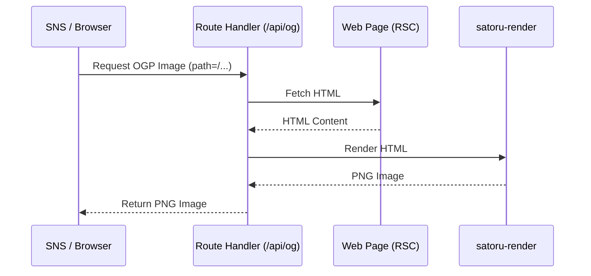

Next.js で OGP 画像を作る際、標準的な選択肢は `@vercel/og` (Satori) ですが、CSS の制約に泣かされた経験はないでしょうか。「ブラウザで表示されているこのレイアウトをそのまま OGP にしたいだけなのに、OGP 用に JSX を書き直すのが面倒すぎる」――そんな課題を解決するために開発したのが [**`satoru-render`**](https://www.npmjs.com/package/satoru-render) です。

コンセプトは「HTML をそのまま画像に変換する」。かなりの再現性に到達した結果、ふと「OGP 画像もページ自体をそのまま使えばいいのでは？」と思いつきました。

この記事では、Next.js の App Router (RSC) で作成したページをそのまま画像化する手法を、天気予報アプリのサンプルを例に解説します。

# サンプルサイト

実際にサイトの HTML をそのまま OGP 画像に変換した例です。サイトのデザインと OGP 画像がほぼ一致しているのがわかると思います。

https://next-rsc-ogp.vercel.app/

OGP画像


https://next-rsc-ogp.vercel.app/forecast/120000

OGP画像


_※ 開発中、AI が勝手にテキストグラデーションを使ってきたのですが、`satoru-render` が未対応だったため急遽実装を追加しました。最近の複雑な CSS もかなり動くようになっています。_

ソースコード: [SoraKumo001/next-rsc-ogp](https://github.com/SoraKumo001/next-rsc-ogp)

# 仕組みの概要

Route Handler (`/api/og`) をハブにして、以下のフローで画像を生成します。

1. `/api/og?path=/xxx` へのリクエストを Route Handler が受ける。
2. Route Handler 内で、対象パス (`/xxx`) に対して自分自身のサーバーへ `fetch` を飛ばす。
3. レンダリング済みの HTML を取得し、そのまま `satoru-render` に渡す。
4. 生成された PNG を返す。



**「OGP 専用のコンポーネントを一切書かなくていい」** というのが最大の強みです。

ただし、ブラウザ相当のレンダリングをサーバーで行うため生成には数秒かかります。実運用では Vercel の Edge Network などのキャッシュを併用するのが前提になります。

# 実装のポイント

### 1. OGP 生成 API (`app/api/og/route.tsx`)

自分自身のサーバーから HTML を引っこ抜き、画像化するコア部分です。

```tsx
import { NextResponse } from "next/server";
import { render } from "satoru-render";

export async function GET(request: Request) {
  try {
    const url = new URL(request.url);
    const baseUrl = url.origin;
    const targetPath = url.searchParams.get("path") || "/";
    const targetUrl = new URL(targetPath, baseUrl);

    // 他のクエリパラメータも引き継ぐ
    url.searchParams.forEach((value, key) => {
      if (key !== "path") targetUrl.searchParams.set(key, value);
    });

    // 1. 自分自身のページをフェッチして HTML を取得
    const response = await fetch(targetUrl.toString());
    if (!response.ok) throw new Error(`Fetch failed: ${response.status}`);
    const html = await response.text();

    // 2. HTML をそのまま画像化
    const png = await render({
      value: html,
      width: 1800, // レンダリング時のベース幅
      outputWidth: 1200, // 最終出力
      outputHeight: 630,
      fit: "cover", // 1200x630に収める
      fitPosition: { y: 0, x: 0.5 }, // 上部中央を基準に
      baseUrl, // CSS/画像の相対パス解決用
      format: "png",
    });

    return new NextResponse(Buffer.from(png), {
      status: 200,
      headers: {
        "Content-Type": "image/png",
        "Cache-Control": "public, s-maxage=60, stale-while-revalidate=36000",
      },
    });
  } catch (err) {
    return NextResponse.json({ error: "Generation failed" }, { status: 500 });
  }
}
```

RSC のページは `fetch` 時にサーバーサイドでデータ取得が完了した状態の HTML を返してくれるので、これだけで動的なデータが反映された画像になります。

### 2. メタデータの設定

各ページでは、自身のパスをパラメータとして API を呼び出すように設定します。

```tsx
export async function generateMetadata(props: {
  params: Promise<{ code: string }>;
  searchParams: Promise<{ [key: string]: string | string[] | undefined }>;
}) {
  const params = await props.params;
  const searchParams = await props.searchParams;
  const code = params.code;

  // URLのクエリパラメータも含めてパスを構築
  const queryString = new URLSearchParams(searchParams as any).toString();
  const path = `/forecast/${code}${queryString ? `?${queryString}` : ""}`;

  return {
    title: "天気予報",
    openGraph: {
      images: [`/api/og?path=${encodeURIComponent(path)}`],
    },
  };
}
```

# このアプローチの何が良いのか

実際に運用してみると、いくつかの大きなメリットを感じます。

1. **デザインの同期コストがゼロ**: UI を変更すれば OGP も勝手に変わります。「サイトは更新したけど OGP 用のコンポーネントを直し忘れた」という事故が物理的に起きません。
2. **Tailwind CSS がそのまま使える**: Satori では使えないプロパティを気にする必要がほぼありません。
3. **Web フォントの自動適用**: `next/font` で読み込んだフォントも HTML 内の CSS を解釈して反映されます。
4. **URL 状態の再現**: クエリパラメータで UI を切り替えている場合も、その URL を `path` に渡すだけで「その状態」が画像になります。

# まとめ

「ページそのものを画像にする」という力技に近い手法ですが、`satoru-render` のレンダリング精度が上がったことで現実的な選択肢になりました。

特に、複雑なレイアウトを OGP に反映させたい場合や、運用コストを極限まで下げたい場合には非常に強力な武器になるはずです。

`satoru-render` の詳細な仕組みについては、こちらの解説記事も併せてどうぞ。

https://zenn.dev/sora_kumo/articles/satoru-render-explanation
