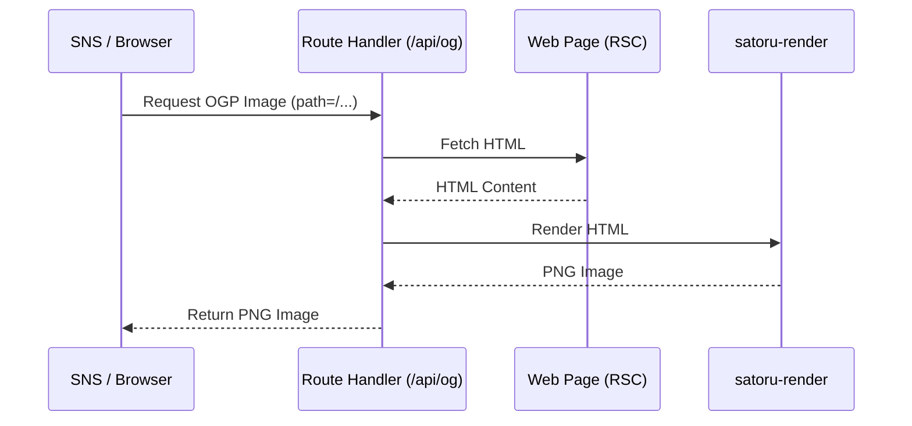

# OGP画像の作成

OGPイメージの生成ライブラリとしてNext.jsでは`@vercel/og`がOGP画像生成のためによく使われています。内部ではSatoriというライブラリが利用されています。ただ、SatoriはCSSによるレイアウトや装飾が限定的なので、もっと高機能なOGP画像を生成するために [`satoru-render`](https://www.npmjs.com/package/satoru-render) を開発しました。基本的にはHTMLをそのまま画像に変換するのがコンセプトです。サポートできるCSSを増やし続けた結果、かなりの再現性に到達しました。そこで気が付きました。HTMLをそのまま画像に変換できるなら、OGPイメージもページ自体をそのまま使えばよいのではないかと。

Webアプリケーションにおいて、動的なOGP（Open Graph Protocol）画像を生成することは、SNS等でのシェア効果を高めるために非常に重要です。その中で「Webページ用のUI」と「OGP用のUI」を別々に実装・管理しなければならないという課題がありました。

この記事では、**`satoru-render`** を使用し、**Next.jsのApp Router (RSC: React Server Components) で作成したWebページのHTMLを、そのままOGP画像に変換する手法**について、実際の天気予報アプリケーション（本プロジェクト）をサンプルとして解説します。

# サンプルサイト

satoru-renderでサイトのHTMLをそのままOGP画像に変換したサンプルサイトです。サイトの内容とOGP画像がほぼ一致しています。ただ、使用しているCSSの構造によっては、必ずしもレンダリングが再現できるわけではありません。今回もこのサンプルを作り始めたときに、AIがテキストグラデーションをぶっこんできたのですが、satoru-renderは対応しておらず、急遽追加対応しています。

サンプルサイトのコードはこちらです。

https://github.com/SoraKumo001/next-rsc-ogp

---

https://next-rsc-ogp.vercel.app/

OGP画像


---

https://next-rsc-ogp.vercel.app/forecast/120000

OGP画像


# 仕組みの概要

`satoru-render` は、HTML/CSSを解釈して画像（PNGなど）を出力するレンダリングエンジンです。この機能をNext.jsのRoute Handler (`/api/og`) と組み合わせることで、以下の非常にシンプルなフローを実現できます。

1. OGP画像リクエストが `/api/og?path=/forecast/130000` のように届く。
2. Route Handler内で、対象のパス (`/forecast/130000`) に対して自身のサーバーへ `fetch` リクエストを行う。
3. レンダリング済みの完全なHTML文字列を取得する。
4. 取得したHTML文字列をそのまま `satoru-render` に渡し、PNG画像を生成して返す。



これにより、**OGP専用のJSXコンポーネントを一切書くことなく、実際のWebページと全く同じデザインのOGP画像を自動生成**することが可能になります。

ただ、CSSやフォントの読み込みなどを、ブラウザと同じことを一から行っているため、レンダリングに数秒かかります。また、今回はHTMLが完全に生成されていることが前提となるため、クライアント側のJavaScript動作を前提としているページでは、正しくOGP画像を生成できません。その場合はJSDOMを利用してHTMLをレンダリングするという前処理がさらに必要になりますが、動作自体は不可能ではありません。

---

# 実装の解説（サンプルプロジェクトより）

本プロジェクト（天気予報アプリ）を例に、具体的な実装を見ていきましょう。

## 1. OGP画像生成APIの実装 (`app/api/og/route.tsx`)

OGP画像を生成するエンドポイントです。対象となるページのHTMLを取得し、画像化します。

```tsx
import { NextResponse } from "next/server";
import { render } from "satoru-render";

export async function GET(request: Request) {
  try {
    const url = new URL(request.url);
    const baseUrl = url.origin;
    // OGP化したいページのパスを取得（例: /forecast/130000）
    const targetPath = url.searchParams.get("path") || "/";

    const targetUrl = new URL(targetPath, baseUrl);

    // 'path' 以外のクエリパラメータもターゲットURLに引き継ぐ
    url.searchParams.forEach((value, key) => {
      if (key !== "path") {
        targetUrl.searchParams.set(key, value);
      }
    });

    // 1. HTTP経由で表示対象のページのHTMLをフェッチ
    const response = await fetch(targetUrl.toString());
    if (!response.ok) {
      throw new Error(`Failed to fetch HTML: ${response.status}`);
    }
    const html = await response.text();

    // 2. 取得したHTML文字列をそのまま satoru-render に渡して画像化
    const png = await render({
      value: html,
      width: 1800, // キャンバスのベース幅（高さは自動計算）
      outputWidth: 1200, // 最終的なOGP画像の出力幅
      outputHeight: 630, // 最終的なOGP画像の出力高さ
      fit: "cover", // キャンバスを出力サイズにどのように合わせるか
      fitPosition: { y: 0, x: 0.5 }, // 上部中央を基準に切り取る
      baseUrl, // 相対パスの解決用（画像やフォントなどのリソース取得に使用）
      format: "png",
    });

    // 3. PNG画像としてレスポンスを返す
    return new NextResponse(Buffer.from(png), {
      status: 200,
      headers: {
        "Content-Type": "image/png",
        "Cache-Control": "public, s-maxage=60, stale-while-revalidate=36000",
      },
    });
  } catch (err: unknown) {
    return NextResponse.json(
      { error: "Failed to generate image" },
      { status: 500 },
    );
  }
}
```

**ポイント:**

- `fetch(targetUrl)`: 自分自身のサーバー内のページにアクセスし、RSCとしてレンダリング済みのHTMLを取得しています。データフェッチなども完了した状態のHTMLが手に入ります。
- `render()`: `satoru-render` のコア関数です。`value` にHTML文字列を渡すだけで高度な描画が行われます。
- `fit: "cover"`, `fitPosition`: Webページは縦に長くなることが多いですが、OGP画像（1200x630）に綺麗に収めるために、上部中央（`y: 0`, `x: 0.5`）を基準にしてトリミング（`cover`）するように設定しています。
- `baseUrl`: HTML内に含まれる相対パスのCSSファイルやWebフォントなどのリソースを正しく解決するために必須の設定です。

## 2. 各ページでのメタデータ設定 (`app/forecast/[code]/page.tsx` など)

次に、各ページでこのAPIを呼び出すようにOGPのメタデータを設定します。

```tsx
import { getMetadata } from "@/lib/metadata";
import { getForecast } from "@/lib/jma";

export async function generateMetadata(props: {
  params: Promise<{ code: string }>;
  searchParams: Promise<{ [key: string]: string | string[] | undefined }>;
}) {
  const params = await props.params;
  const searchParams = await props.searchParams;
  const code = params.code;

  // URLのクエリパラメータも含めてパスを構築
  const queryString = new URLSearchParams(searchParams as any).toString();
  const path = `/forecast/${code}${queryString ? `?${queryString}` : ""}`;

  try {
    const forecast = await getForecast(code);
    const areaName = forecast[0].timeSeries[0].areas[0].area.name;

    return getMetadata({
      title: `${areaName}の天気予報`,
      description: `${areaName}の直近の天気予報を表示します。`,
      path, // 構築したパスを渡す
    });
  } catch {
    return getMetadata({ title: "天気予報", path });
  }
}
```

ヘルパー関数 `getMetadata` 側で、渡された `path` をもとにOGPエンドポイントへのURLを組み立てています。

```ts
// lib/metadata.ts 内
const ogImage = `/api/og?path=${encodeURIComponent(path)}`;
```

これにより、クエリパラメータが変更された場合でも、その状態を保持したままページが `fetch` され、表示状態に完全に一致するOGP画像が生成されます。

---

## このアプローチのメリット

1. **デザインの二重管理からの解放**
   一番の大きなメリットです。Webページ用のReactコンポーネント（Tailwind CSSなどのユーティリティクラスでのスタイリングを含む）をそのまま流用できるため、OGP用のJSXを別途記述・保守する手間が省けます。
2. **RSC (React Server Components) の恩恵**
   サーバーサイドでデータをフェッチしてレンダリングされた完成形のHTMLを画像化するため、非同期データを含むリッチなページも容易にOGP化できます。
3. **Webフォントや外部リソースの自動解決**
   `satoru-render` はHTML内の `<style>` や `<link>` を解釈するため、ページで利用しているWebフォント（`next/font` 含む）や画像をそのままOGP画像にも綺麗に反映できます。
4. **クエリパラメータを通じた動的制御**
   `path` にクエリを含めることで、「特定の地域を選択した状態」や「表示モード」など、URLベースで表現できるUIのバリエーションをすべて自動的に画像化できます。

# まとめ

`satoru-render` と自身のサーバーへの `fetch` リクエストを組み合わせることで、Next.jsのRSCページをそのままOGP画像として出力する、シンプルかつ強力なシステムを構築できます。

複雑なレイアウトや、作成済みのリッチなWebページをそのままSNSでシェアさせたい場合に、このアプローチは非常に有効な選択肢となります。

`satoru-render` の詳細な解説はこちらにあります。

https://zenn.dev/sora_kumo/articles/satoru-render-explanation
