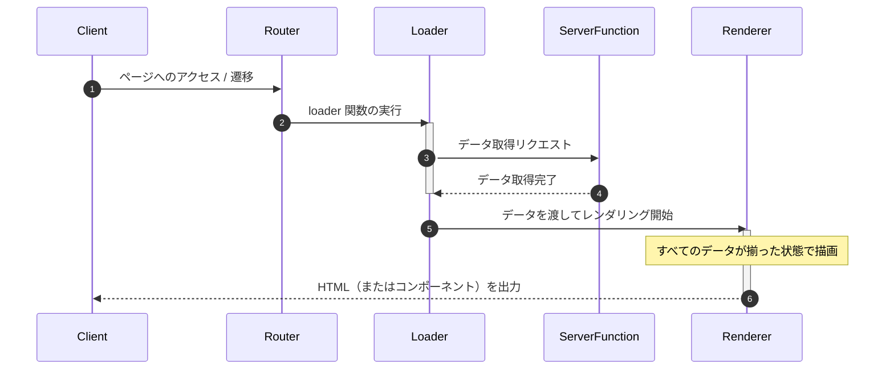
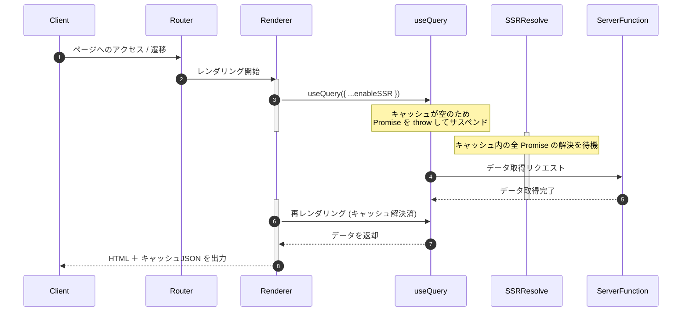

※ サンプルコード： https://github.com/SoraKumo001/tanstack-start-ssr

TanStack StartでSSR時にTanStack Query（React Query）を組み合わせようとすると、途端にコードが肥大化します。リクエストごとにサーバー側で `QueryClient` を作り、ルートローダーで `prefetchQuery` を回して、完了後にキャッシュを `dehydrate` してHTMLに埋め込み、さらにクライアント側で `HydrationBoundary` で復元する...。この一連の作業をすべてのルートで定義するのは骨が折れます。

こうしたSSR特有のデータ受け渡し作業を、React標準の **Suspense** の仕組みを使ってほぼ自動化し、ボイラープレートを消し去ってくれるのが **`react-query-ssr`** です。

この記事では、TanStack Start上で `react-query-ssr` を使う基本設定、Server Functionsとの組み合わせ、標準 `loader` との使い分け、内部で何が起きているのかを順に見ていきます。

---

## 検証に使用した構成

今回の動作確認では、Next.jsのSSRデモアプリをTanStack Startに移植したプロジェクトを使用しています。

| 項目           | 使用したもの            | 補足                                 |
| :------------- | :---------------------- | :----------------------------------- |
| フレームワーク | TanStack Start          | Next.jsのSSRデモアプリを移植         |
| UI             | React 19                | Client Component中心の構成           |
| ビルド         | Vite                    | TanStack StartのVite構成             |
| スタイリング   | Tailwind CSS v4         | `@tailwindcss/vite` を利用           |
| データ取得     | `@tanstack/react-query` | コンポーネント内の `useQuery` で取得 |
| SSR補助        | `react-query-ssr@1.0.4` | `SSRProvider` と `enableSSR` を利用  |
| サーバー処理   | Server Functions        | `createServerFn` で外部API取得を実行 |
| デプロイ想定   | Cloudflare Workers      | Wranglerでビルド・デプロイ           |

なお、この記事の内容は `react-query-ssr@1.0.4` と TanStack Query v5 系で検証しています。`react-query-ssr` は `useQuery` に `suspense` オプションを渡すことでSSR時の待機を実現しますが、TanStack Query v5 の公式リファレンスでは通常の `useQuery` オプションとして `suspense` は前面に出ていません。そのため、導入時は利用する `@tanstack/react-query` と `react-query-ssr` の組み合わせを固定して動作確認しておくのが安全です。

言い換えると、この記事で紹介する方法はReact Query公式の `HydrationBoundary` を使った明示的なSSRとは別に、`prefetchQuery` や `dehydrate` の記述を減らすための小さなラッパーを使うアプローチです。TanStack Query側のメジャーバージョンを上げる場合は、`enableSSR` が型・実行時の両方で期待通り動くかを最初に確認してください。

---

## まずは最小構成

導入にあたって書くコードはほとんどありません。

アプリケーション全体を `<SSRProvider>` で囲み、`useQuery` を呼ぶ際に `...enableSSR` オプションを添えるだけです。これでサーバーサイドは非同期データの解決が完了するまでレンダリングを待ち、取得したデータを自動でシリアライズしてクライアント側のReact Queryキャッシュへ引き継いでくれます。

通常のReact Query SSRでは、サーバー側で先にクエリを取得してから、そのキャッシュを明示的に渡す必要があります。

```tsx
await queryClient.prefetchQuery({
  queryKey: ["simple"],
  queryFn: fetchSimple,
});

const dehydratedState = dehydrate(queryClient);

return (
  <HydrationBoundary state={dehydratedState}>
    <Simple />
  </HydrationBoundary>
);
```

`react-query-ssr` を使う場合、取得処理はコンポーネント側の `useQuery` に寄せられます。

```tsx
const { data } = useQuery({
  ...enableSSR,
  queryKey: ["simple"],
  queryFn: fetchSimple,
});
```

この差分が、ルートごとの `prefetchQuery` や `dehydrate` を減らせる理由です。

### Providerを設置する

`src/routes/__root.tsx` で、アプリケーション全体を `QueryClientProvider` と `<SSRProvider>` で囲みます。

SSRでReact Queryを使う場合、サーバー側の `QueryClient` はリクエストごとに作成する必要があります。グローバルなシングルトンにしてしまうと、別ユーザーや別リクエストのキャッシュが混ざる可能性があるためです。以下の例では、TanStack Start側のルーターコンテキストからリクエスト単位の `queryClient` を受け取る前提にしています。

たとえばルーターを作る側では、次のように `QueryClient` をコンテキストへ渡します。

```tsx:src/router.tsx
import { QueryClient } from '@tanstack/react-query'
import { createRouter } from '@tanstack/react-router'
import { routeTree } from './routeTree.gen'

export function getRouter() {
  const queryClient = new QueryClient({
    defaultOptions: {
      queries: {
        staleTime: 1000 * 60 * 5,
      },
    },
  })

  return createRouter({
    routeTree,
    context: {
      queryClient,
    },
  })
}
```

```tsx:src/routes/__root.tsx
import {
  HeadContent,
  Scripts,
  createRootRouteWithContext,
} from '@tanstack/react-router'
import { QueryClientProvider } from '@tanstack/react-query'
import type { QueryClient } from '@tanstack/react-query'
import { SSRProvider } from 'react-query-ssr'
import Header from '../components/Header'
import Footer from '../components/Footer'
import appCss from '../styles.css?url'

export const Route = createRootRouteWithContext<{
  queryClient: QueryClient
}>()({
  head: () => ({
    meta: [
      { charSet: 'utf-8' },
      { name: 'viewport', content: 'width=device-width, initial-scale=1' },
      { title: 'TanStack Start SSR Demo' },
    ],
    links: [{ rel: 'stylesheet', href: appCss }],
  }),
  shellComponent: RootDocument,
})

function RootDocument({ children }: { children: React.ReactNode }) {
  const { queryClient } = Route.useRouteContext()

  return (
    <html lang="ja">
      <head>
        <HeadContent />
      </head>
      <body>
        <QueryClientProvider client={queryClient}>
          <SSRProvider>
            <Header />
            {children}
            <Footer />
            <Scripts />
          </SSRProvider>
        </QueryClientProvider>
      </body>
    </html>
  )
}
```

### `useQuery` で `enableSSR` を使う

データを取得するコンポーネント側では、`useQuery` を呼ぶ際に `...enableSSR` をスプレッド展開して渡します。

```tsx:src/routes/simple.tsx
import { createFileRoute } from '@tanstack/react-router'
import { useQuery } from '@tanstack/react-query'
import { enableSSR } from 'react-query-ssr'

export const Route = createFileRoute('/simple')({
  component: SimpleRouteComponent,
})

function SimpleRouteComponent() {
  const { data } = useQuery({
    ...enableSSR, // これだけでSSR時のデータ解決を待機＆ハイドレーション
    queryKey: ['simple'],
    queryFn: () => 'Hello world!',
  })

  if (!data) return null

  return (
    <main className="p-8">
      <h1>Simple Sample</h1>
      <p>{data}</p>
    </main>
  )
}
```

`enableSSR` を使ったクエリは、サーバー側ではPromiseを投げてレンダリングを待機させます。そのため初回描画に、サーバーとクライアントで値が変わるものを混ぜないように注意してください。

たとえば `Date.now()`、`Math.random()`、ロケール依存の日付整形、初回だけ変わるルーターの遷移状態などをそのまま表示に使うと、Hydration Mismatchの原因になります。リロード中の表示のようなクライアント側だけの状態は、`useState(false)` などで初期値をサーバーと揃えてから、ユーザー操作後に切り替えるのが安全です。

---

## Server Functionsと組み合わせる

TanStack Startでデータ取得やデータベース操作を行う際、避けて通れないのが **Server Functions**（`createServerFn`）です。

`react-query-ssr` の主役はあくまでReact QueryのSSRですが、実際のアプリでは `queryFn` の中でサーバー専用処理を呼びたくなります。外部APIへのプロキシ、DBアクセス、秘密情報を使う処理などをブラウザに持ち出さずに済ませるために、ここでServer Functionsを組み合わせます。

Server Functionsは、サーバー側だけで実行したい処理を通常のJavaScript/TypeScriptの関数として定義し、クライアントからRPC（遠隔手続き呼び出し）のように直接インポートして呼び出せる機能です。

```typescript
export const fetchWeatherServer = createServerFn({ method: "GET" })
  .inputValidator((input: number) => input)
  .handler(async ({ data: id }) => {
    // このハンドラ内はサーバーサイドでのみ実行される
    const r = await fetch(
      `https://www.jma.go.jp/bosai/forecast/data/overview_forecast/${id}.json`,
    );
    if (!r.ok) throw new Error(`HTTP error! status: ${r.status}`);
    return r.json();
  });
```

内部的には、ビルド時にクライアント用のコードとサーバー用のコードが自動で切り分けされます。クライアント側から呼び出すと自動生成されたAPIエンドポイントへHTTPリクエスト（GETやPOST）を送信し、サーバー側ではそのエンドポイントでハンドラ内のロジックが直接実行されるため、開発者はネットワーク境界を意識することなくサーバー処理を組み込めます。

ただし、Server Functionsは同一オリジンのRPCエンドポイントとして扱われます。公開APIとして外部から呼ばせたい用途ではServer Routesを使い、Server Functions側はCSRF保護やOrigin/Refererチェックが有効になる構成を確認しておくのが安全です。

Zodなどを用いた入力値のバリデーション（`inputValidator`）やミドルウェアによる認証チェックも標準でサポートしており、Next.jsのServer Actionsに似ていますが、よりデータ取得（GET）にも最適化されている点と、React Queryの `queryFn` との親和性が非常に高いのが特徴です。

---

## 実装例

ここからは、少し実践的な実装を2つ紹介します。

### 1. 複数データの並列取得と一括リロード（お天気アプリ）

気象庁（JMA）のAPIから、東京、神奈川、千葉の予報をサーバーサイドで並列取得し、クライアント側でまとめてキャッシュ更新できるようにします。

ルート側は `useQuery` に `...enableSSR` を渡すだけです。

```tsx:src/routes/weather.tsx
import { createFileRoute } from '@tanstack/react-router'
import { useQuery } from '@tanstack/react-query'
import { enableSSR } from 'react-query-ssr'
import WeatherPage, { weatherLoader } from '../components/pages/weather'

export const Route = createFileRoute('/weather')({
  component: WeatherRouteComponent,
})

function WeatherRouteComponent() {
  const { data } = useQuery({
    ...enableSSR,
    queryKey: ['weather'],
    queryFn: () => weatherLoader(),
  })

  if (!data) return null

  return <WeatherPage forecasts={data} />
}
```

サーバー関数とコンポーネント側は次のように定義します。

```tsx:src/components/pages/weather.tsx
import { useState } from 'react'
import { createServerFn } from '@tanstack/react-start'
import { useQueryClient } from '@tanstack/react-query'

export const FETCH_CODES = [120000, 130000, 140000]

export const fetchWeatherServer = createServerFn({ method: 'GET' })
  .inputValidator((input: number) => input)
  .handler(async ({ data: id }) => {
    const r = await fetch(`https://www.jma.go.jp/bosai/forecast/data/overview_forecast/${id}.json`)
    if (!r.ok) throw new Error(`HTTP error! status: ${r.status}`)
    return r.json()
  })

const fetchWeatherResults = async () => {
  return await Promise.all(
    FETCH_CODES.map(async (code) => {
      try {
        const data = await fetchWeatherServer({ data: code })
        return { code, data, error: null }
      } catch (e) {
        return { code, data: null, error: (e as Error).message }
      }
    })
  )
}

export const getWeatherDataServer = createServerFn({ method: 'GET' }).handler(
  async () => {
    return await fetchWeatherResults()
  }
)

export const weatherLoader = async () => {
  return await getWeatherDataServer()
}

export default function WeatherPage({ forecasts }) {
  const queryClient = useQueryClient()
  const [refreshing, setRefreshing] = useState(false)

  const handleReload = async () => {
    setRefreshing(true)
    await queryClient.invalidateQueries({ queryKey: ['weather'] })
    setRefreshing(false)
  }

  return (
    <div>
      <button onClick={handleReload} disabled={refreshing}>
        {refreshing ? '更新中...' : '全地域更新'}
      </button>
      <WeatherCards results={forecasts} />
    </div>
  )
}
```

表示用の `WeatherCards` は省略していますが、ポイントは `forecasts` という通常のpropsとしてSSR済みデータを渡している点です。React Queryの `initialData` オプションと混同しないよう、サンプル側でもデータの中身が分かる名前にしています。

### 2. URLクエリパラメータと連携したページネーション（Hacker News風アプリ）

Hacker NewsのAPIを利用し、ページ番号をURLのクエリ（`?page=1`）と連動させてSSRします。URLが変わるたびにサーバー側で新しいページのデータを取得します。

```tsx:src/routes/news.tsx
import { createFileRoute } from '@tanstack/react-router'
import { useQuery } from '@tanstack/react-query'
import { enableSSR } from 'react-query-ssr'
import NewsPage, { newsLoaderServer } from '../components/pages/news'

type NewsSearch = {
  page?: number
}

export const Route = createFileRoute('/news')({
  validateSearch: (search: Record<string, unknown>): NewsSearch => {
    return {
      page: Number(search.page) || 1,
    }
  },
  component: NewsRouteComponent,
})

function NewsRouteComponent() {
  const { page } = Route.useSearch()
  const currentPage = page || 1

  const { data } = useQuery({
    ...enableSSR,
    queryKey: ['news', currentPage],
    queryFn: () => newsLoaderServer({ data: { page: currentPage } }),
  })

  if (!data) return null

  return <NewsPage news={data} page={currentPage} />
}
```

ページ切り替え時は、TanStack Routerの `router.navigate` でクエリを変更するだけで、ブラウザの履歴と同期しながらシームレスなデータ取得と描画が行われます。

---

## 標準の `loader` とどう使い分けるか

TanStack Startには標準で強力なデータ取得機構である `loader` が備わっています。ルート単位の `loader` と、`react-query-ssr` を利用したコンポーネント単位の `useQuery` フェッチは、アプローチが根本的に異なります。

### TanStack Start 標準の `loader`

ルーターが画面遷移を処理する段階（レンダリング前）ですべてのデータを並列で取得するため、パフォーマンス面では最も有利です。レンダリング中にフェッチが走って描画が遅延するウォーターフォール（Waterfall）現象が起きません。また、URLパラメータの変更とローダーを連動させる（`loaderDeps`）のも簡単です。

その代わり、データはルートで一括取得されるため、設計によっては末端のコンポーネントへ渡すPropsのバケツリレー（Props Drilling）が発生しやすくなります。「UIコンポーネント」と「データ取得処理」の記述場所がファイル単位で分かれてしまうのも、開発時の行き来が発生して少し扱いづらく感じる部分です。

### `react-query-ssr` (useQueryによるコンポーネント単位の取得)

コンポーネントの中に直接 `useQuery` を記述できるため、データとUIが同じ場所にまとまる（Co-location）のが魅力です。当然、Propsによるデータの引き回しは一切不要になります。

さらに、React Queryが持つ強力なキャッシュ制御（`staleTime` による無駄なフェッチ防止、画面フォーカス時の自動再取得、重複クエリのマージなど）をそのままSSR時にも使えます。SSR対応のための `prefetchQuery` や `HydrationBoundary` を書かなくて済むため、記述量が圧倒的に少なくなります。

懸念点としては、非同期データに依存するコンポーネントが親子関係でネストしている場合、描画時のウォーターフォールが発生するリスクがあります。ただし、`react-query-ssr` はサーバー側ですべてのPromiseの解決を待ってからHTMLを返すため、SSR時にデータが欠けたHTMLが送られるといった心配はありません。

たとえば親コンポーネントがユーザー情報を取得し、その結果に含まれる `user.id` を使って子コンポーネントが通知一覧を取得する場合、子のクエリは親の結果が出るまで開始できません。このようにデータ依存が直列になる画面では、ルートの `loader` で先に必要データをまとめるほうが分かりやすいことがあります。

一方、天気一覧やニュース一覧のように、コンポーネントが自分の表示に必要なデータを独立して取れる場合は `react-query-ssr` と相性が良くなります。

### 比較まとめ

| 評価軸                          | TanStack Start 標準 `loader`     | `react-query-ssr` (useQuery)       |
| :------------------------------ | :------------------------------- | :--------------------------------- |
| **データの定義場所**            | ルート（ルーティング層）         | コンポーネント（ビュー層）         |
| **コンポーネントの独立性**      | ルートからのデータ注入に依存する | コンポーネント単体で自己完結する   |
| **Propsの引き回し**             | 発生しやすい                     | 不要 (Co-location)                 |
| **キャッシュ管理機能**          | ルート単位のキャッシュが中心     | クエリ単位で細かく制御できる       |
| **並列性 / ウォーターフォール** | 優秀（遷移前に一括パラレル取得） | 注意（親子関係のデータ依存に起因） |
| **React Query SSR記述量**       | -                                | 極小 (`...enableSSR` を渡すだけ)   |

### 動作フローの視覚的比較

両者の処理フローの違いは、以下のシーケンス図の通りです。

#### 1. TanStack Start 標準 `loader` のフロー

ルーターがレンダリングを開始する前に、ローダーを介してすべてのデータを並列取得します。コンポーネントが描画される時点では、データがすでに完全に揃っています。



#### 2. `react-query-ssr` のフロー

ルーターは待機せず、即座にコンポーネントのレンダリングを開始します。データが未解決であるため React は一時的にサスペンド（待機）し、`SSRResolve` が背後ですべての非同期 Promise の解決を待ってから最終出力を返します。



---

## 裏側で動いている仕組み

なぜ `<SSRProvider>` と `...enableSSR` を書くだけで、ハイドレーションの設定なしにSSRができるのでしょうか。その秘密は `react-query-ssr` のシンプルな内部実装に隠されています。

ここからは仕組みが気になる人向けの説明です。使うだけなら、前半のProvider設置と `...enableSSR` の追加まで分かっていれば問題ありません。

### `enableSSR` の正体

`enableSSR` の実体は以下のようなオブジェクトを返すだけの変数です。

```javascript
export const enableSSR = { suspense: isServer };
```

サーバーサイド（`isServer = true`）の時は `suspense: true` になるため、データ取得が完了していない `useQuery` はPromiseを `throw` し、Reactのレンダリングプロセスを一時停止（サスペンド）させます。

クライアントサイド（`isServer = false`）では `suspense: false` に切り替わるため、マウント後の再取得などでコンポーネントが不用意にサスペンドするのを防ぎ、UI側でローディングインジケータなどの状態を普通にハンドリングできるようにしています。

この点は `react-query-ssr` の実装に依存するため、TanStack Query側のメジャーバージョンを上げる際は特に確認が必要です。

### `SSRResolve` による待機制御

`<SSRProvider>` の末尾には `<SSRResolve />` というコンポーネントが配置されています。

```tsx
const SSRResolve = () => {
  const ssrContext = useContext(promiseContext);
  const queryClient = useQueryClient();

  // 現在QueryCacheに登録されているすべての非同期処理のPromiseを取得
  const promises = queryClient
    .getQueryCache()
    .getAll()
    .flatMap(({ promise }) => (promise ? [promise] : []));

  // 未解決のPromiseがある場合、Promise.all でまとめて再throwする
  if (isServer && !promises.every((p) => ssrContext.promises?.includes(p))) {
    ssrContext.promises = promises;
    throw Promise.all(promises);
  }

  if (isServer) {
    ssrContext.finished = true;
    ssrContext.resolve();
  }
  return null;
};
```

サーバー側でのレンダリング時、`useQuery` に遭遇するとキャッシュにPromiseが登録され、レンダリングが一時中断します。再レンダリングが走るたびに `SSRResolve` がキャッシュ内の全Promiseをスキャンし、まだ解決していないPromiseがあれば `Promise.all` を投げてReactのSSRレンダラーをサスペンドさせます。これですべての非同期データが揃うのを確実に待つわけです。

### クライアントへのデータ転送と復元

すべてのPromiseが解決されてレンダリングが終わると、`<SSRDataRender>` コンポーネントが動作します。

```tsx
export const SSRDataRender = ({ builtIn }) => {
  // ...
  const value = isServer ? dehydrate(queryClient) : ssrContext.value;

  return (
    <script id="__REACT_QUERY_DATA_PROMISE__" type="application/json">
      {JSON.stringify(value)}
    </script>
  );
};
```

これによって、サーバーで取得が完了したクエリキャッシュが自動的にHTMLへJSONスクリプトとして書き出されます。

ライブラリ利用者は通常、この `<script>` の生成処理を直接触る必要はありません。自前で同じような仕組みを実装する場合は、JSONをHTML内に埋め込む際のエスケープにも注意してください。ここではライブラリの内部挙動を説明する目的で、実装の要点だけを抜粋しています。

ブラウザ側で `<SSRProvider>` が最初にマウントされる際、この script タグを読み取って自動的に `hydrate(queryClient, value)` を走らせます。

```tsx
export const SSRProvider = ({ children }) => {
  const queryClient = useQueryClient();
  const property = useRef(Promise.withResolvers()).current;

  if (!isServer && !property.finished) {
    const node = document.getElementById("__REACT_QUERY_DATA_PROMISE__");
    if (node) {
      const value = JSON.parse(node.innerText);
      hydrate(queryClient, value); // クライアント側のクエリキャッシュへ復元
      property.value = value;
    }
    property.finished = true;
  }
  // ...
};
```

この処理のおかげで、ブラウザ上のJavaScriptが起動した時点ですでにキャッシュにデータが存在しており、データ未復元によるHydration Mismatchを避けながら高速で描画を終えることができます。

---

## クリーンなコードベースを維持するために

`react-query-ssr` を使うことで、TanStack Start上でのReact QueryのSSR対応が圧倒的にスマートになります。

各ルートに `prefetchQuery` や `dehydrate` を記述する手間が丸ごと省け、何よりPropsの引き回しから解放されるのは大きな強みです。Reactの標準機能であるSuspenseに沿ったクリーンな設計のため、フレームワーク固有のAPIに振り回されることなく安定して動作します。

ルート遷移前に必要なデータを確実に揃えたい場合はTanStack Start標準の `loader`、コンポーネント単位でReact Queryのキャッシュ制御を活かしながらSSRしたい場合は `react-query-ssr`、という切り分けで考えると選びやすくなります。

TanStack StartとReact Queryを使った開発を行う際は、ぜひこのシンプルなアプローチを試してみてください。
