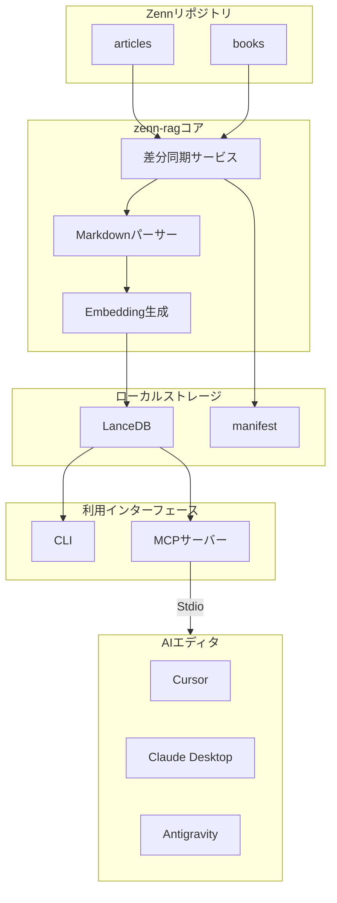

## 記事を書くときの「過去記事参照」の壁

Zennで技術記事や本を書き続けていると、次のような場面に出会うことがあります。

- 「前にも似たようなライブラリの設定やトラブルシューティングを書いたはずだけど、どの記事だったか思い出せない」
- 「いま書いている記事の末尾に、過去の関連記事へのリンクを貼りたいけれど、タイトルやスラッグを探すのに手間がかかる」
- 「過去に書いたコード例を少し直して引用したいのに、ファイルを探してコピペするのが面倒」

記事やチャプターが増えるほど、過去の記録は役立つ蓄積になりますが、リポジトリの中から必要な箇所を探し出す手間も増えていきます。

エディタで Grep 検索をしても、完全一致する単語しかヒットしません。「認証周りの設計パターン」や「パフォーマンス改善の勘所」のような、意味的なニュアンスでの検索はあまり得意ではありません。

そうした用途を想定して作ったのが、Zennリポジトリ向けの Vector DB と RAG ツールキット `zenn-rag` です。

https://www.npmjs.com/package/zenn-rag

```bash
# すぐに試せる npx コマンド
npx zenn-rag --help
```

`zenn-rag` は、Markdown記事や本（Books）を見出し構造やコードブロックをできるだけ保ったままベクトル化し、CLI検索のほか、Model Context Protocol (MCP) サーバーとしてエディタ（Cursor、Claude Desktop、Antigravityなど）から利用できます。

この記事では、過去記事を参照しながら新しい記事を書くときの使い方と、それを支える実装上のポイント（チャンキング、LanceDBの選定、差分同期、MCPツール設計）を順に紹介します。

---

## 執筆体験はどう変わるか？（活用シナリオ）

`zenn-rag` をエディタやAIアシスタントと組み合わせた場合の使い方を、具体的なシナリオで見てみます。

### シナリオ1: 執筆中に過去記事の解説やコードを呼び出す

新しい記事を書いている最中に、AIエディタのチャット欄でこのように尋ねます。

> 執筆者: 「前に書いたCloudflare WorkersのWASM連携について、メモリ制限の注意点とサンプルコードを教えて」

AIアシスタントは `zenn-rag` の MCP ツール（`search_articles`）を呼び出し、ベクトルDBから関連度の高い過去記事のセクションを取得します。

````markdown
### [1] Cloudflare WorkersでRust/WASMを動かす実践ガイド (類似度: 89.2%)

- 見出し: パフォーマンスチューニング > WASMメモリ制限と対策
- URL: https://zenn.dev/username/articles/cloudflare-workers-wasm
- トピック: cloudflare, wasm, rust

```rust
// 当該記事のコードブロックが切断されずにそのまま届く
...
```
````

````

記事のURLだけでなく、どの見出しに書かれていたか、該当のコードブロックまで含めてAIのコンテキストに入るため、過去の記録を参照しながら続きの文章や解説を書くときに利用できます。

### シナリオ2: 執筆中の文章から「関連記事リンク」を提案する

記事を書き終えたあとの関連記事リンク集の作成にも使えます。
執筆中のテキストや段落を選択して、AIに「関連記事のリンクを提案して」と頼むと、`suggest_related_links` ツールが起動します。

```markdown
### 執筆支援: 推薦リンク一覧

- [Next.js App Router実践入門 - キャッシュ戦略の基本](https://zenn.dev/username/articles/nextjs-app-router-cache) (類似度: 87.5%)
  > 関連箇所: 本章ではfetchキャッシュとReact cacheの違い、再検証のタイミングについて...

- [実践Webアプリケーション設計 - 第3章: データフェッチと状態管理](https://zenn.dev/username/books/web-app-design/data-fetching) (類似度: 83.1%)
  > 関連箇所: サーバーコンポーネントでの並行データ取得におけるベストプラクティス...
````

すでに Markdown のリンク形式（`[タイトル - 見出し](URL)`）で出力されるため、記事末尾に貼り付けて使うことができます。

### シナリオ3: 書いたら反映されるウォッチモード

`zenn-rag index --watch` をターミナルで起動しておけば、記事を保存したタイミングで差分検知（MD5ハッシュ比較）とベクトル化が行われます。
同期にかかる時間は数十ミリ秒〜数秒程度で、書いたばかりのドラフトも参照対象に含めることができます。

---

## 全体アーキテクチャと技術スタック

`zenn-rag` は、軽量さ、ローカルでの完結、AIエディタとの連携を意識して設計しています。



### なぜ LanceDB なのか？

RAGを構築する際、PineconeやQdrant、ChromaなどのVector DBが使われることがあります。一方で、個人の執筆環境では「Dockerコンテナを立ち上げる」「クラウドDBの無料枠を管理する」といった準備が負担になる場合があります。

そこで採用したのが [LanceDB](https://lancedb.com/) です。

1. サーバーレス・組み込み型: SQLiteのように、ローカルのディレクトリ（デフォルトでは `.vectordb`）を指定するだけでファイルベースで動きます。追加のデーモン起動は不要です。
2. 高速なカラムナーフォーマット: Apache Arrowベースで設計されており、数千〜数万チャンク規模の検索であればローカル環境で数ミリ秒〜数十ミリ秒でコサイン類似度検索ができます。
3. `.gitignore` に1行追加するだけ: データベースファイルはすべて `.vectordb` ディレクトリ内に収まるため、Gitリポジトリに混ざりにくくなっています。

### なぜ MCP (Model Context Protocol) なのか？

独自の拡張機能（VS Code Extension）を作る方法もありますが、メンテナンスの負担が増え、CursorやClaude Desktopなど複数のツールを使い分ける際に手間がかかります。

Anthropicが策定した MCP (Model Context Protocol) を使うことで、`zenn-rag mcp` を起動するだけで、MCP対応のAIエディタから共通のツールとして呼び出せるようになります。

---

## 執筆を支える設計とコード解説

ここからは、`zenn-rag` の内部実装での工夫をコードとともに紹介します。

### 1. 執筆文脈を保つMarkdown階層チャンキング (`parser.ts`)

RAGの検索精度に影響する要素の一つがチャンキング（文章の分割方法）です。
一般的な「1000文字ごとに区切る」方式では、次のようなことが起こりがちです。

1. コードブロックの途中で切断される: シンタックスが壊れ、AIがコードの意味を捉えにくくなる。
2. 見出しの文脈が失われる: 「具体的な設定手順」というテキストだけが切り出され、どのツールの何についての話かが分かりにくくなる。

これを避けるため、`src/parser.ts` では独自の解析とチャンキングを行っています。

#### 見出しスタックによる階層パンくず保持

見出し（H1〜H4）をパースする際、スタック構造で現在の見出しの深さを追跡します。

```typescript:src/parser.ts
export function splitMarkdownIntoSections(
  markdown: string,
): { heading: string; text: string }[] {
  const lines = markdown.split(/\r?\n/);
  const sections: { heading: string; text: string }[] = [];

  const headingStack: { level: number; text: string }[] = [];
  let currentLines: string[] = [];
  let currentHeading = "イントロダクション";

  function saveCurrentSection() {
    const text = currentLines.join("\n").trim();
    if (text.length > 0) {
      sections.push({
        heading: currentHeading,
        text,
      });
    }
    currentLines = [];
  }

  for (const line of lines) {
    const headingMatch = line.match(/^(#{1,4})\s+(.+)$/);
    if (headingMatch) {
      saveCurrentSection();
      const level = headingMatch[1].length;
      const title = headingMatch[2].trim();

      // 現在の見出しレベル以上のものをスタックからポップ
      while (
        headingStack.length > 0 &&
        headingStack[headingStack.length - 1].level >= level
      ) {
        headingStack.pop();
      }
      headingStack.push({ level, text: title });
      // パンくず形式で連結（例: "アーキテクチャ > Vector DB選定 > LanceDB"）
      currentHeading = headingStack.map((h) => h.text).join(" > ");
    } else {
      currentLines.push(line);
    }
  }

  saveCurrentSection();
  return sections;
}
```

これにより、各チャンクには `アーキテクチャ > Vector DB選定 > LanceDB` のような階層文字列が残り、検索時にも見出しの文脈を参照できます。

#### コードフェンスを保護する段落分割

セクションが長い（デフォルト2,000文字以上）場合に段落単位で分割しますが、その際コードブロック（``` や ~~~）の内部では分割しないようにしています。

```typescript:src/parser.ts
export function extractParagraphs(text: string): string[] {
  const lines = text.split(/\r?\n/);
  const paragraphs: string[] = [];
  let currentParagraphLines: string[] = [];
  let inCodeFence = false;
  let codeFenceMarker = "";

  for (const line of lines) {
    const trimmed = line.trim();
    const fenceMatch = trimmed.match(/^(`{3,}|~{3,})/);

    if (fenceMatch) {
      const marker = fenceMatch[1][0]; // '`' または '~'
      if (!inCodeFence) {
        inCodeFence = true;
        codeFenceMarker = marker;
      } else if (marker === codeFenceMarker) {
        inCodeFence = false;
        codeFenceMarker = "";
      }
    }

    // コードブロックの外側で、かつ空行の場合のみ段落の区切りとする
    if (!inCodeFence && trimmed === "") {
      if (currentParagraphLines.length > 0) {
        paragraphs.push(currentParagraphLines.join("\n"));
        currentParagraphLines = [];
      }
    } else {
      currentParagraphLines.push(line);
    }
  }

  if (currentParagraphLines.length > 0) {
    paragraphs.push(currentParagraphLines.join("\n"));
  }

  return paragraphs;
}
```

この処理により、コード例のインデントや閉じ括弧が欠けにくく、まとまりのある単位でベクトルDBに格納できます。

---

### 2. LanceDBストレージとモデル次元数の自動検知 (`store.ts`)

`src/store.ts` では、LanceDBの接続管理・レコード挿入・類似度検索をまとめています。

#### モデルや次元数が変わった場合の自動リカバリ

ローカルLLMやEmbeddingモデルを使っていると、「昨日は Gemini（768次元）を使っていたけれど、今日はローカルの LM Studio（bge-m3: 1024次元）に切り替えたい」という場合があります。
一般的なVector DBでは次元数の不一致でエラーになることがありますが、`zenn-rag` では同期開始時にテーブルの次元数を確認し、違いがあればリセットする仕組みを入れています。

```typescript:src/store.ts
async getVectorDimension(): Promise<number | null> {
  const table = await this.getTable();
  if (!table) return null;

  try {
    const rows = await table.query().limit(1).toArray();
    if (rows.length === 0) return null;
    const firstRow = rows[0];
    // ベクトル配列の長さを確認
    if (Array.isArray(firstRow.vector)) {
      return firstRow.vector.length;
    }
    if (firstRow.vector && typeof firstRow.vector === "object" && "length" in firstRow.vector) {
      return (firstRow.vector as { length: number }).length;
    }
    return null;
  } catch {
    return null;
  }
}
```

同期サービス側で、新しく生成したベクトルの次元数と既存テーブルの次元数を比較し、一致しない場合は `table.drop()` して再構築を促すため、DBのスキーマ移行を意識する場面が少なくなります。

#### コサイン類似度による検索

検索処理では、クエリ文字列から生成したベクトルを渡し、コサイン距離でソートします。

```typescript:src/store.ts
async search(
  queryVector: number[],
  options: { limit?: number; topic?: string } = {},
): Promise<SearchResult[]> {
  const table = await this.getTable();
  if (!table) return [];

  const limit = options.limit ?? 5;
  let builder = table.vectorSearch(queryVector).distanceType("cosine");

  // トピック指定がある場合はSQLライクなWHERE句でフィルタリング
  if (options.topic) {
    const sanitizedTopic = options.topic.replace(/['"\\]/g, "");
    builder = builder.where(`topics LIKE '%${sanitizedTopic}%'`);
  }

  const rows = await builder.limit(limit).toArray();

  return rows.map((row) => {
    // コサイン距離 (0〜2) から類似度スコア (1 - distance) へ変換
    const distance = typeof row._distance === "number" ? row._distance : 1.0;
    const score = Math.max(0, 1 - distance);
    return rowToSearchResult(row, score);
  });
}
```

---

### 3. MD5差分同期 (`sync-service.ts`)

記事数が数十〜数百本になると、毎回すべてのファイルをEmbedding APIに投げると時間やコストがかかります。

`src/services/sync-service.ts` では、`.vectordb/manifest.json` に各記事・チャプターのファイルMD5ハッシュを記録しています。

```typescript:src/services/sync-service.ts
const contentHash = computeHash(fileContent);
const manifestEntry = manifest.entries[target.slug];

// ハッシュが前回と同一ならベクトル化処理をスキップ
if (manifestEntry && manifestEntry.contentHash === contentHash) {
  continue;
}
```

同期時にはハッシュが変化したファイル、または新規追加されたファイルのみを抽出し、その差分だけをEmbedding処理してDBを更新します。普段の執筆中の同期は1〜2秒程度で終わることが多いです。

また、`--watch` オプションを指定した場合は、Node.jsの `fs.watch` を使って `articles/` および `books/` を監視し、ファイル保存時に差分同期が行われるようにしています。

---

### 4. MCPツールの設計 (`commands/mcp.ts`)

MCPサーバー（`src/commands/mcp.ts`）では、公式の `@modelcontextprotocol/sdk` を使用して、Zenn執筆向けの5つのツールを定義しています。

| ツール名                | 説明                                                     | 活用シーン                                           |
| :---------------------- | :------------------------------------------------------- | :--------------------------------------------------- |
| `search_articles`       | 過去記事・本から意味的に類似するセクションを検索         | 昔書いたコードや解説を引用・参照したいとき           |
| `suggest_related_links` | 執筆中の文章から関連する過去記事を推薦しMarkdownリンク化 | 記事末尾や本文中の関連記事リンクを作りたいとき       |
| `get_article`           | 指定スラッグの記事・チャプターの内容を取得               | 過去記事の構成や流れ全体をAIに把握させたいとき       |
| `list_topics`           | 蓄積されたトピック（タグ）と記事数の一覧を取得           | これまでに書いた分野やタグ表記の揺れを確認したいとき |
| `sync_index`            | インデックスの差分同期を実行                             | 新しい記事を書いた直後に反映させたいとき             |

ここでは `suggest_related_links` を例に紹介します。

```typescript:src/commands/mcp.ts
server.tool(
  "suggest_related_links",
  "執筆中の記事テキストや構想メモから、関連記事や本チャプターを推薦し、Markdownリンク形式で提示します。",
  {
    text: z.string().describe("執筆中の文章、段落、または構想メモ"),
    limit: z.number().optional().default(3).describe("提案するリンクの最大件数"),
  },
  async ({ text, limit }) => {
    const queryVector = await getEmbedding(text);
    const results = await store.search(queryVector, { limit });

    const links = results
      .map((r) => {
        const score = (r.score * 100).toFixed(1);
        const excerpt = r.text.slice(0, 120).replace(/\n+/g, " ");
        return `- [${r.title} - ${r.heading}](${r.url}) (類似度: ${score}%)\n  > 関連箇所: ${excerpt}...`;
      })
      .join("\n\n");

    return {
      content: [
        {
          type: "text",
          text: `### 執筆支援: 推薦リンク一覧\n\n${links}`,
        },
      ],
    };
  }
);
```

執筆中のドラフト文章を渡すと、関連度の高い過去記事のタイトル、見出し、URL、該当箇所の抜粋がMarkdown形式で返ってきます。

---

## 自分のZennリポジトリですぐに試すセットアップ

お手元のZennリポジトリ（`zenn-cli` で管理しているリポジトリ）で使い始める手順です。

### 1. インストール

```bash
# プロジェクトの開発依存として追加する場合
pnpm add -D zenn-rag
# または npm / yarn / bun
npm install -D zenn-rag
```

※インストールせずに `npx zenn-rag <command>` で直接動かすことも可能です。

### 2. 環境設定（`.env`）

リポジトリルートに `.env` を作成します。
ローカル（LM Studio / Ollama）かクラウドAPI（Gemini / OpenAI）かを選択できます。

#### おすすめ①：LM Studio を使ったローカル構成

外部との通信を行わず、ローカルでベクトル化したい場合の例です。
LM Studio で `text-embedding-bge-m3` などをロードし、Local Serverを起動（ポート1234）しておきます。

```env
EMBEDDING_PROVIDER=openai
BASE_URL=http://localhost:1234/v1
EMBEDDING_MODEL=text-embedding-bge-m3
API_KEY=lm-studio

ZENN_USERNAME=your_zenn_id
VECTOR_DB_DIR=.vectordb
```

#### おすすめ②：Google Gemini API

ローカルサーバーを立てずに試したい場合は、Google AI Studio の API キーを使えます。

```env
EMBEDDING_PROVIDER=gemini
API_KEY=AIzaSy...
EMBEDDING_MODEL=gemini-embedding-001

ZENN_USERNAME=your_zenn_id
```

> 注意: `.vectordb` はローカルデータベースファイルのため、Git管理から除外してください。
>
> ```gitignore
> .vectordb
> ```

### 3. インデックス作成と検索（CLI）

まずはリポジトリ内の記事と本をインデックス化します。

```bash
# 初回インデックス作成
npx zenn-rag index

# CLIで検索テスト
npx zenn-rag search "Next.js App Router Server Actions"
```

執筆中はウォッチモードにしておくと便利です。

```bash
npx zenn-rag index --watch
```

### 4. AIエディタへのMCP登録

#### Cursor の場合

`~/.cursor/mcp.json`（またはプロジェクトの `.cursor/mcp.json`）に設定を追加します。

```json
{
  "mcpServers": {
    "zenn-rag": {
      "command": "npx",
      "args": ["-y", "zenn-rag", "mcp"],
      "cwd": "/path/to/your/zenn-repository"
    }
  }
}
```

#### Claude Desktop の場合

`claude_desktop_config.json` に設定を追加します。

```json
{
  "mcpServers": {
    "zenn-rag": {
      "command": "npx",
      "args": ["-y", "zenn-rag", "mcp"],
      "cwd": "/path/to/your/zenn-repository"
    }
  }
}
```

設定後、AIエディタのチャットで「過去記事から〇〇について調べて」や「この記事の関連記事リンクを作って」と話しかけると、ツールが呼び出されるようになります。

---

## おわりに

技術記事を書き続けていると、過去の記事にはそのときの考えや試行錯誤が残っていきます。

ただ、記憶だけで過去の記録を正確に引き出すのは難しくなっていきます。
`zenn-rag` は、過去の記録をAIアシスタント経由で参照しやすくするためのツールです。

- 書いた記事がそのまま参照対象として溜まっていく
- 過去記事の参照や引用、内部リンク作成の手間を減らせる

よければ手元のリポジトリで試してみてください。
